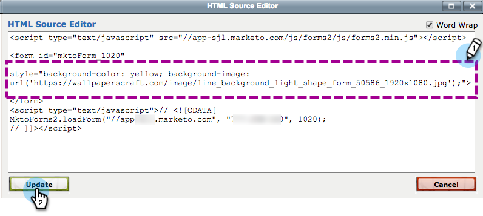

# Een formulier insluiten in een webcampagne {#embed-a-form-into-a-web-campaign}

Zie hoe u een Marketo-formulier kunt insluiten in een webcampagne (Dialoogvenster, In Zone of Widget).

1. Klik met de rechtermuisknop op een goedgekeurd formulier. Selecteren **Code insluiten**.

   

1. Kopieer de code.

   

1. Ga in Persoonlijke webweergave naar **Webcampagnes**.

   

1. Klikken **Nieuwe campagne maken**.

   

1. Klik in de Rich Text Editor op het HTML-pictogram.

   

1. Plak de insluitcode van het formulier in de HTML Source Editor. Klikken **Bijwerken**.

   

1. Het formulier wordt niet weergegeven in de editorweergave, maar u kunt het voorbeeld bekijken om te zien hoe het in een campagne wordt weergegeven.

1. Klikken **Starten** om de campagne te starten.

   >[!NOTE]
   >
   >Wijzigingen in de velden van het formulier moeten worden aangebracht in de marketingactiviteiten van Marketo in het concept van het formulier bewerken.

## Op drie manieren een achtergrondafbeelding aan een formulier toevoegen {#three-ways-to-add-a-background-image-to-a-form}

Als u een achtergrondafbeelding aan het formulier wilt toevoegen, kunt u:

* CSS van een formulierthema bewerken
* Dialoogvenster- of widgetkleuren wijzigen in Campagne instellen
* CSS-code toevoegen aan het script

Als u de CSS van een formulierthema wilt bewerken, raadpleegt u [dit artikel](/help/marketo/product-docs/demand-generation/forms/form-design/edit-the-css-of-a-form-theme.md).

U wijzigt als volgt de kleur van het dialoogvenster of de widget in de campagne Set:

1. Selecteer in de Rich Text Editor een type dialoogvenster en een dialoogstijl, koptekstkleur en achtergrondkleur om de achtergrondkleuren van het formulier aan te passen. Klikken **Opslaan**.

   

1. Hier is een voorbeeld van hoe een Modern Stijl van de Dialoog van de Versiering met een lichtpaarse kopbal en achtergrondkleur kijkt.

   

CSS-code toevoegen aan het script:

1. Klik in de Rich Text Editor op het HTML-pictogram.

   

1. Plak de insluitcode van het formulier met de achtergrondstijlcode in de HTML Source Editor. Klikken **Bijwerken**.

   

1. Klikken **Voorvertoning** om te zien hoe het in een campagne wordt weergegeven (het formulier wordt niet weergegeven in de editorweergave). Hier volgt een voorbeeld van hoe de bovenstaande formuliercode wordt weergegeven in een campagne met een achtergrondafbeelding.

   

>[!MORELIKETHIS]
>
>* [CSS van een formulierthema bewerken](/help/marketo/product-docs/demand-generation/forms/form-design/edit-the-css-of-a-form-theme.md)
>* [Bericht met dank weergeven zonder opvolgingspagina](https://developers.marketo.com/blog/show-thank-you-message-without-a-follow-up-landing-page/)
>* [Forms 2.0](https://experienceleague.adobe.com/en/docs/marketo-developer/marketo/javascriptapi/forms-api-reference)
