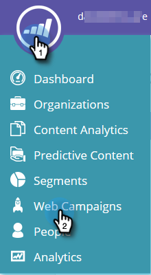

# Campagnegegevens exporteren {#export-web-campaign-data}

Voer de volgende eenvoudige stappen uit om uw webcampagnegegevens te exporteren.

1. Ga naar **[!UICONTROL Web Campaigns]** .

   

1. Klik rechtsboven op de pagina op het pictogram CSV exporteren.

   

1. Open of sla uw bestand op.

   

1. Bekijk uw bestand voor nuttige statistieken.

   
