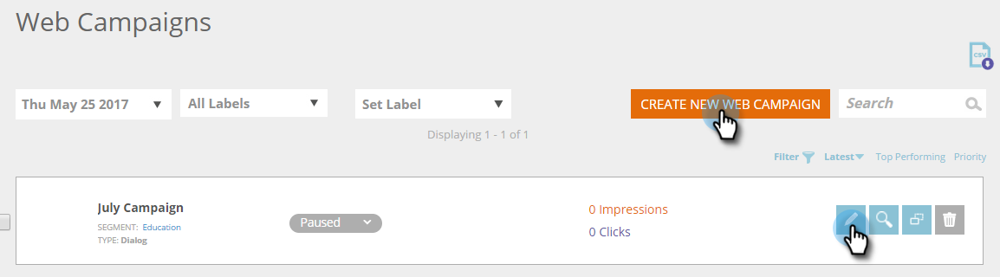
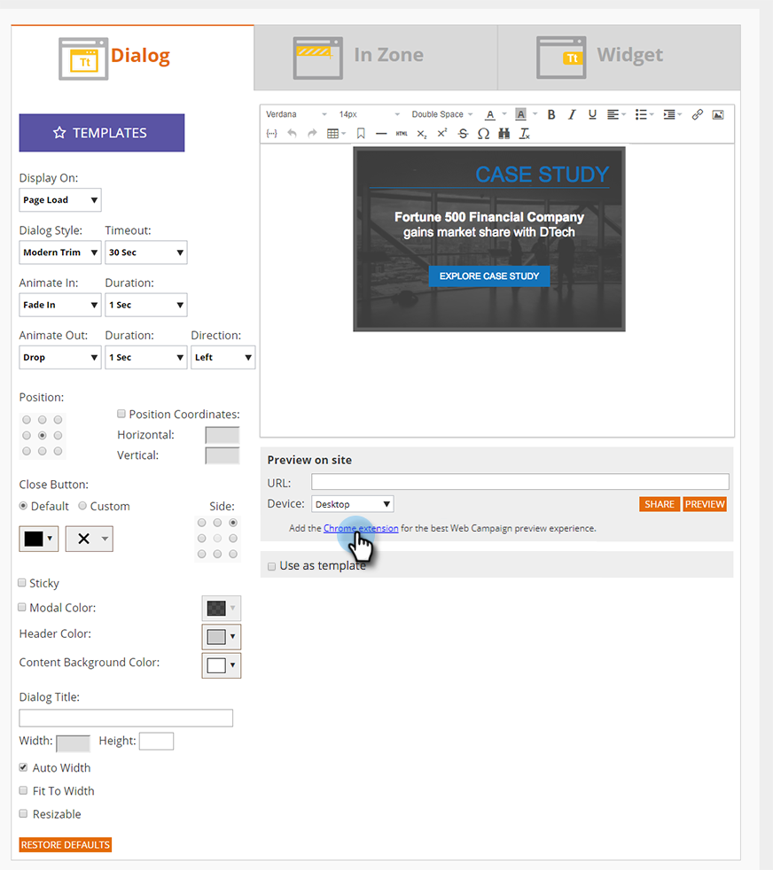

# Een webcampagne voorvertonen en testen {#preview-and-test-a-web-campaign}

In dit artikel worden verschillende manieren getoond waarop u een webcampagne kunt voorvertonen en ook hoe u deze kunt testen met behulp van een sandboxsegment dat live op uw website staat.

## Een webcampagne voorvertonen op de ontwerppagina {#preview-a-web-campaign-on-the-creation-page}

1. Ga naar **Web** **Campagnes**.

   

1. Klik op** Nieuwe webcampagne maken****** of op het pictogram om een bestaande campagne te bewerken.

   

1. Voeg in Voorvertoning op site de pagina-URL toe en klik op **Voorvertoning**. Er wordt een nieuw venster of tabblad geopend met de voorvertoning van de campagne.

   

   >[!TIP]
   >
   >Klik **Delen** om een e-mail met een vaste URL van de campagnevoorproef te openen.

   >[!NOTE]
   >
   >U kunt ook een browserplug-in installeren (of [Chrome](https://chrome.google.com/webstore/detail/marketo-web-personalizati/ldiddonjplchallbngbccbfdfeldohkj) of [Firefox](https://docs.marketo.com/display/docs/assets/mwp-0.0.0.8.xpi)) voor de beste ervaring bij het voorvertonen van uw campagne. Zie de onderstaande paragraaf.

## Voorproef een Campagne van het Web op de Aanmaakpagina die Browser Plug-in {#preview-a-web-campaign-on-the-creation-page-using-the-browser-plug-in} gebruikt

1. Voer stap 1 en 2 uit `section above` uit.
1. Klik op de koppeling naar de browserplug-in (in dit geval gebruiken we Chrome).

   

1. Er wordt een nieuw venster/tabblad geopend. Klik **Toevoegen aan Chrome**.

   

1. Klik **Extensie toevoegen**.

   

1. Ga terug naar Marketo. Voeg de pagina-URL toe en klik op **Voorvertoning**.

   

1. Er wordt een nieuw venster/tabblad geopend waarin u kunt zien hoe de campagne er op een bureaublad, telefoon of tablet uitziet.

   

## Een webcampagne voorvertonen op de webpagina voor campagnes {#preview-a-web-campaign-on-the-web-campaigns-page}

1. Als u de lijst met uw webcampagnes bekijkt, kiest u gewoon een campagne en klikt u op het pictogram **Voorvertoning**.

   

   Eenvoudig!

## Een webcampagne voorvertonen op uw website {#preview-a-web-campaign-on-your-website}

Maak een sandboxsegment en -campagne.

1. Ga naar **Segmenten**.

   

1. Klik **Nieuw maken**.

   

1. Geef het segment een naam.
1. Sleep onder Gedrag de optie Inclusief pagina&#39;s naar het canvas. Voeg de waarde *sandbox=1* toe. Klik op Campagne opslaan en definiëren.

   

1. Voor de Vastgestelde pagina van de Campagne van het Web, verander het Segment van het Doel in het zandbaksegment door het van de lijst te selecteren.

   

1. Voltooi de campagne creatief en klik **Launch**.\
   

1. Ga naar uw website en voeg de URL-parameter &quot;?sandbox=1&quot; toe aan het einde van de URL. Voorbeeld: [www.marketo.com?sandbox=1](https://www.marketo.com/?sandbox=1)
1. Bekijk de campagnereactie op uw website.

>[!NOTE]
>
>Campagnes reageren slechts eenmaal tijdens een bezoekerssessie. Wis de browsercookies om de campagne weer te zien.

>[!NOTE]
>
>Omleidingscampagnes kunnen niet worden voorvertoond. De enige manier om deze te testen is door een sandboxsegment te gebruiken (dat zich richt op specifieke pagina&#39;s - *sandbox=redirect*)

