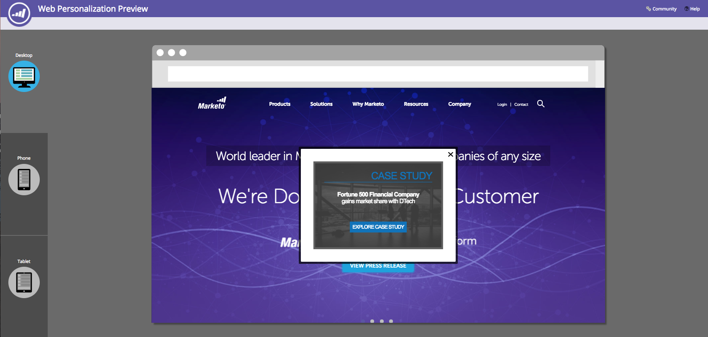
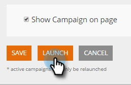

# Een webcampagne voorvertonen en testen {#preview-and-test-a-web-campaign}

In dit artikel worden verschillende manieren getoond waarop u een webcampagne kunt voorvertonen en ook hoe u deze kunt testen met behulp van een sandboxsegment dat live op uw website staat.

>[!NOTE]
>
>In de voorvertoning ziet u alleen hoe de campagne eruitziet op de gekozen site. Koppelingen en widgets zijn niet functioneel om onjuiste kliks/weergaven in de analyse te voorkomen.

## Een webcampagne voorvertonen op de ontwerppagina {#preview-a-web-campaign-on-the-creation-page}

1. Ga naar **[!UICONTROL Web Campaigns]** .

   

1. Klik op **[!UICONTROL Create New Web Campaign]** of het pictogram om een bestaande campagne te bewerken.

   

1. Voeg de pagina-URL toe in Voorvertonen op de site en klik op **[!UICONTROL Preview]** . Er wordt een nieuw venster of tabblad geopend met de voorvertoning van de campagne.

   

   >[!TIP]
   >
   >Klik op **[!UICONTROL Share]** om een e-mail te openen met een vaste URL van de voorvertoning van de campagne.

   >[!NOTE]
   >
   >U hebt ook de optie om een browser stop-binnen (of [[!DNL Chrome] te installeren ](https://chrome.google.com/webstore/detail/marketo-web-personalizati/ldiddonjplchallbngbccbfdfeldohkj) of [[!DNL Firefox] ](https://rtp-static.marketo.com/rtp/libs/mwp-0.0.0.8.xpi)) voor de beste ervaring previewing uw campagne. Zie de onderstaande paragraaf.

## Een webcampagne voorvertonen op de pagina Maken met de plug-in Browser {#preview-a-web-campaign-on-the-creation-page-using-the-browser-plug-in}

1. Voer stap 1 en 2 uit de bovenstaande sectie uit.

1. Klik op de koppeling naar de browserplug-in (in dit geval gebruiken we [!DNL Chrome] ).

   

1. Er wordt een nieuw venster/tabblad geopend. Klik op **[!UICONTROL Add to Chrome]**.

   

1. Klik op **[!UICONTROL Add Extension]**.

   

1. Ga terug naar Marketo. Voeg de pagina-URL toe en klik op **[!UICONTROL Preview]** .

   

1. Er wordt een nieuw venster/tabblad geopend waarin u kunt zien hoe de campagne er op een bureaublad, telefoon of tablet uitziet.

   

## Een webcampagne voorvertonen op de webpagina Campagnes {#preview-a-web-campaign-on-the-web-campaigns-page}

1. Als u de lijst met uw webcampagnes bekijkt, kiest u gewoon een campagne en klikt u op het pictogram **[!UICONTROL Preview]** .

   

   Eenvoudig!

## Een webcampagne voorvertonen op uw website {#preview-a-web-campaign-on-your-website}

Maak een sandboxsegment en -campagne.

1. Ga naar **[!UICONTROL Segments]** .

   

1. Klik op **[!UICONTROL Create New]**.

   

1. Geef het segment een naam.

1. Sleep [!UICONTROL Behavioral] onder [!UICONTROL Include Pages] naar het canvas. Voeg de waarde &#42; zandbak=1 &#42; toe. Klik op **[!UICONTROL Save & Define Campaign]**.

   

1. Voor de Vastgestelde pagina van de Campagne van het Web, verander het Segment van het Doel in het zandbaksegment door het van de lijst te selecteren.

   

1. Voltooi de campagne creatief en klik op **[!UICONTROL Launch]** .

   

1. Ga naar uw website en voeg de URL-parameter &quot;?sandbox=1&quot; toe aan het einde van de URL. Voorbeeld: `www.marketo.com?sandbox=1` .

1. Bekijk de actie van de campagne op uw website.

>[!NOTE]
>
>Campagnes reageren slechts eenmaal tijdens een bezoekerssessie. Wis de browsercookies om de campagne weer te zien.

>[!NOTE]
>
>Omleidingscampagnes kunnen niet worden voorvertoond. De enige manier om hen te testen is door een zandbaksegment te gebruiken (dat richt door specifieke pagina&#39;s - &#42; zandbak=redirect &#42;)
