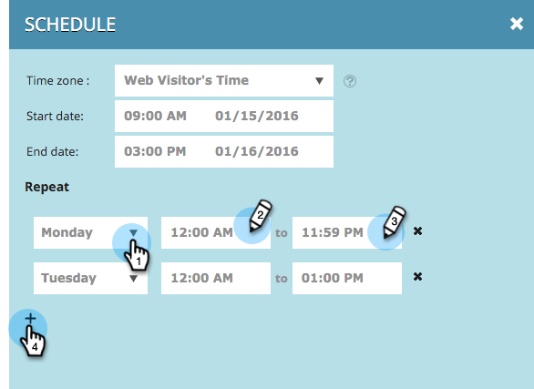

# Een webcampagne plannen {#schedule-a-web-campaign}

Als u weet wanneer u uw Webcampagne wilt lopen, kunt u het vooraf plannen. Begin- en einddatums, herhalingen en meerdere dagen kunt u eenvoudig instellen.

U kunt de webcampagne plannen op basis van de tijd van de webbezoeker of een geselecteerde tijdzone.

>[!NOTE]
>
>**Voorbeeld**
>
>Het plannen van begin en einddata is groot voor een geplande gebeurtenis, zoals een Webinar, die voor een specifieke periode loopt. Herhalingen zijn perfect voor een speciale aanbieding die elke week maar op een bepaalde dag loopt.

1. Ga naar **[!UICONTROL Web Campaigns]** .

   

   >[!NOTE]
   >
   >Om het gemakkelijker te maken om de campagne te vinden u wilt, gebruik de [&#x200B; filtereigenschap &#x200B;](/help/marketo/product-docs/web-personalization/working-with-web-campaigns/filter-web-campaigns.md).

1. Open het menu Campagnestatus en selecteer **[!UICONTROL Schedule]** .

   

1. Selecteer in het dialoogvenster Herhaling planning de tijdzone voor de campagne

   

   >[!TIP]
   >
   >Met de standaardinstelling worden campagnes uitgevoerd in de tijdzone van de webbezoeker.

1. Selecteer een begindatum en -tijd en een einddatum en -tijd.

   

   >[!NOTE]
   >
   >U kunt de datum en tijd selecteren in het keuzemenu en de kalender of ze handmatig invoeren. De tijden zijn in 12 uur AM/PM tijd.

1. Standaard wordt de campagne elke dag tussen de begin- en einddatum uitgevoerd. Als u de campagne alleen op specifieke dagen of op specifieke tijdstippen wilt uitvoeren, gebruikt u de instellingen voor **[!UICONTROL Repeat]** . Selecteer de dag en de begin- en eindtijd om de campagne weer te geven. Voeg extra dagen toe met het plusteken +.

   

1. Klik op **[!UICONTROL Schedule]**.

   

1. De status van de campagne op de pagina Campagnes verandert in **[!UICONTROL Scheduled]** en het klok-/kalenderpictogram wordt weergegeven. Klik op dit pictogram om het campagnereschema te bewerken.

   

   >[!NOTE]
   >
   >De status van de campagne blijft op **[!UICONTROL Scheduled]** staan, zelfs als de campagne wordt uitgevoerd tijdens de geselecteerde geplande tijd. Wanneer een geplande einddatum is verstreken, verandert de status van de campagne in **[!UICONTROL Paused]** .
