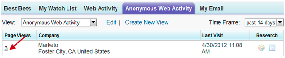

# Opmerkingen bij de release: Mei 2012 {#release-notes-may}

## E-mailprestatierapport Opnieuw ontwerpen {#email-performance-report-redesign}

Opmerking: Dit wordt een gefaseerde uitrol, te beginnen met de release van mei

We hebben ervoor gezorgd dat de e-mailprestatierapporten voor e-mailprestaties en campagnes sneller werden uitgevoerd. We hebben ook de definities van bepaalde metriek verbeterd en de metriek &quot;Verzonden berichten&quot; en &quot;Verzonden leads&quot; geconsolideerd tot één metrische waarde, &quot;Verzonden&quot;. We hebben &quot;geleverde berichten&quot; en &quot;geleverde leads&quot; samengevoegd tot &quot;afgeleverd&quot;.

## Verbeteringen voor stap wachten {#wait-step-enhancements}

Gebruikend nieuwe Geavanceerd wacht eigenschappen, kunt u de wachttijdstap in een Slimme actie van de Stroom van de Campagne vormen &quot;wachten tot&quot;een specifieke dag van de week, de volgende bedrijfsdag, een specifieke datum of een tijd. Deze verbeteringen zorgen ervoor dat uw verplegend e-mails tijdens de kantooruren in de Postbus komen!

Figuur 1. Geef de gewenste wachtstap op om op een werkdag te eindigen

## Gearchiveerde elementen verborgen {#archived-assets-hidden}

Gearchiveerde elementen worden automatisch gefilterd van automatische suggesties, vervolgkeuzelijsten en rapporten, zodat u gemakkelijker kunt terugvinden naar wat u zoekt!

Figuur 2. Voorbeeld van het gearchiveerde e-mailfilter

## New Event Check-in App for iPad {#new-event-check-in-app-for-ipad}

Vereenvoudig het inchecken van gebeurtenissen met onze nieuwe iPad-app! De app voor gebeurtenisinchecken synchroniseert met uw Marketo-programma en kunt u eenvoudig geregistreerde personen in een gebeurtenis controleren en nieuwe leads toevoegen.

Vereist iOS 5.1 of hoger; Alleen iPad.

Figuur 3. Startpagina voor inchecken van gebeurtenissen

Figuur 4. Gebeurteniscontrole: Selecteer uw gebeurtenis!

Figuur 5. Controleer ze in

## Verbeterde URL voor webinaire bevestiging {#enhanced-webinar-confirmation-url}

Nu beschikbaar voor ON24 en Adobe Connect! Neem een unieke koppeling op in het bevestigingsbericht voor elke geregistreerde deelnemer die de nieuwe token `{{member.webinar URL}}` gebruikt. Tot de Adobe Connect-verbeteringen behoren ook de mogelijkheid om het e-mailbericht met informatie over een Adobe-account met de aanmeldings-id en het wachtwoord voor de gebruiker in of uit te schakelen.

Figuur 6. Mensen naar je webinar halen

## Sjabloonvoorbeeld {#template-preview}

Op zoek naar een specifieke sjabloon terwijl u uw e-mail- of landingspagina samenstelt, maar niet zeker hoe het eruit ziet? Met de nieuwe mogelijkheid voor sjabloonvoorvertoning kunt u de geselecteerde sjabloon controleren voordat u een nieuw element opslaat.

Figuur 7. Voorbeeld van de gekozen sjabloon bekijken

## Configureerbaar formulier vooraf invullen {#configurable-form-prefill}

De pre-populatie van vormgegevens van de controle op het abonnementsniveau en overschrijven op het niveau van de landingspagina. Zonder pre-populatie, kunt u ervoor zorgen de lood de meest bijgewerkte informatie verstrekt.

Figuur 8. Configuratie vooraf invullen van formulier in beheerder

Figuur 9. Instelling voor vooraf invullen van formulier bewerken op een bestemmingspagina

## Marketo Treasure Chest {#marketo-treasure-chest}

Verbeter toegang tot experimentele functies die door Marketo Engineers zijn ontwikkeld om uw gebruikerservaring te verbeteren. Deze release bevat E-mail Ongedaan maken, plus de mogelijkheid om opmerkingen in te voeren en met andere gebruikers samen te werken op uw bestemmingspagina&#39;s.

\

Figuur 10. Functies voor schatkist beheren in Admin

## Integratie van Microsoft Dynamics® CRM {#microsoft-dynamics-crm-integration}

Synchroniseer accounts, contactpersonen en leads tussen Marketo en Microsoft Dynamics CRM Online met onze nieuwe, vooraf gebouwde integratie!

Figuur 11. Configuratie Microsoft Dynamics

## Verbeteringen voor Marketo-verkoopinzicht {#marketo-sales-insight-enhancements}

**Abonnement op voettekstopties opzeggen**

Configureer wanneer en als het abonnement op voettekst wordt opgezegd voor e-mails die via Sales Insight worden verzonden.

Figuur 12. Instellingen voor verkoopinzicht in Admin

## Mappen voor e-mailsjablonen voor verkoop {#folders-for-sales-email-templates}

U kunt de e-mailsjablonen die met Marketo Sales Insight worden gedeeld, nu in specifieke mappen ordenen, zodat uw verkopers het juiste e-mailadres gemakkelijker kunnen vinden.

Figuur 13. Kies een map voor uw e-mails

## De Analyse van de Kanaal van de toegang van het Inzicht van de Verkoop {#access-opportunity-analyzer-from-sales-insight}

Geef uw verkopers inzicht in welke marketingactiviteiten de betrokkenheid stimuleren, en gebruik daarbij rechtstreeks toegang tot de Opportunity Analyzer van Marketo Sales Insight. Opmerking. Vereist een licentie voor conjunctuuranalyse.

## Aangepast veld voor contactstatus {#custom-field-for-contact-status}

U kunt een douaneveld in Salesforce nu in kaart brengen om het gebied van de Status voor Contacten in Mijn Beste Bets, Beste Bets van Mijn Team en douanemeningen te bevolken.

Figuur 14. Een aangepast veld toewijzen aan contactpersonen

Pagina&#39;s bezocht door anonieme leads

Boor neer aan de pagina&#39;s die door een anonieme lood van de Anonieme mening van de Activiteit van het Web worden bekeken.

Figuur 15. Zie Anonieme webactiviteit

## Uitgebreide lead en contactpersoon abonneren {#enhanced-lead-and-contact-subscribe}

Volg een lead of neem op elk gewenst moment contact op met de nieuwe knop Abonneren op de pagina met recorddetails.
