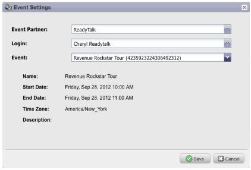

# Opmerkingen bij de release: September 2012 {#release-notes-september}

Deze release bevat zeer vooruitstrevende, geïntegreerde sociale kenmerken en toonaangevende managementtools! Opmerking: sociale functies zijn beschikbaar als invoegtoepassing of als onderdeel van geselecteerde bundels.

## Een YouTube-video publiceren met sociaal delen {#publish-a-youtube-video-with-social-sharing}

Vergroot het publiek voor uw video&#39;s door uw bezoekers aan te moedigen om hen sociaal te delen, gebruikend het nieuwe VideoAandeel op uw landingspagina&#39;s.

## Een knop voor delen toevoegen {#add-a-share-button}

Pas de deelberichten en de weergave van een nieuwe set knoppen voor sociaal delen volledig aan. Leg ook gegevens van het sociale profiel vast terwijl uw leads uw inhoud delen.

## Aanmelden bij sociaal profiel {#social-sign-on}

Verbeter inzicht en verminder wrijving door toe te staan leidt tot prefill vormen met informatie van hun sociale netwerken.

## Openingspagina&#39;s publiceren naar Facebook {#publish-landing-pages-to-facebook}

Vergroot het bereik van uw bestemmingspagina&#39;s door deze rechtstreeks naar Facebook te publiceren, compleet met sociale apps, formulieren en de volledige functionaliteit van de bestemmingspagina&#39;s van Marketo.

## ReadyTalk-gebeurtenisadapter {#readytalk-event-adapter}

Sluit naadloos een Marketo-gebeurtenis aan op een ReadyTalk-vergadering. Gebruik een Marketo-formulier om geregistreerde personen vast te leggen en deze automatisch te registreren in ReadyTalk. Met een bidirectionele synchronisatie kunnen aanwezigheidsgegevens in Marketo worden ingevuld.

## Microsoft Dynamics on Premise {#microsoft-dynamics-on-premise}

Wij steunen nu de Dynamica 2011 van Microsoft op-gebouw met een Internet-Facing plaatsing.

## Webhaken (Schat) {#webhooks-treasure-chest}

Een Webhaak is een user-defined callback van HTTP. Het is een goede manier om gegevens van Marketo naar een andere service te verzenden. Deze functie is momenteel beschikbaar in de Schatkist en wordt momenteel alleen ondersteund in triggercampagnes.

Voorbeelden van hoe u Webhooks kunt gebruiken zijn: het posten van gebruikers - en wachtwoordinformatie aan een ander systeem om een proefrekening tot stand te brengen; verzenden van een SMS-tekstbericht wanneer je een nieuwe lead krijgt.

## Bijwerken naar getMultipleLeads-API {#update-to-getmultipleleads-api}

Er zijn nieuwe filtercriteria toegevoegd aan de API-aanroep getMultipleLeads. Naast filteren op datum ondersteunen we nu aanvullende criteria:

* Datumbereik
* Statische lijstnamen
* Arrays van leadsleutels
