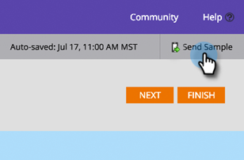

# Opmerkingen bij de release: Herfst 2015 {#release-notes-fall}

De volgende functies zijn opgenomen in de Fall &#39;15-release. Controleer of de Marketo Edition beschikbaar is.

## Abonneren op een slimme lijst {#subscribe-to-a-smart-list}

[Abonneren op een slimme lijst](/help/marketo/product-docs/reporting/basic-reporting/report-subscriptions/subscribe-to-a-smart-list.md)

Met Abonneren op slimme lijst kunnen marketers een slimme lijst exporteren en deze via e-mail versturen naar de belanghebbenden die Marketo niet gebruiken, zoals Sales- of Telemarketing-teams.

De uitvoer kan dagelijks, wekelijks of maandelijks worden gepland, kan eindleveringsdatum hebben en kan worden aangepast om beperkt aantal kolommen te delen.


U kunt meerdere abonnementen maken op een slimme lijst. Per Marketo-exemplaar zijn er maximaal 100 abonnementen met 100 kB leads per abonnement, in verschillende werkruimten.


## Aangepaste Marketo-objecten {#marketo-custom-objects}

[Aangepaste Marketo-objecten](/help/marketo/product-docs/administration/marketo-custom-objects/understanding-marketo-custom-objects.md)

Maak eenvoudig aangepaste objecten via de interface voor beheerders. Momenteel ondersteunen we de mogelijkheid om een aangepast 1:N-object te maken in Marketo en dit aan te sluiten op een lead of een bedrijf.

>[!NOTE]
>
>Marketo Custom Objects zijn niet beschikbaar voor Spark.


## Marketo Insights voor Google Chrome {#marketo-insights-for-google-chrome}

[Marketo Insights voor Google Chrome](/help/marketo/product-docs/marketo-sales-insight/msi-chrome-plugin/using-marketo-insights-for-google-chrome.md)

We zijn blij dat we de release van een update van onze Google Mail Sales Insight-extensie bekend maken! Geef deze weer in de [Chrome Store](https://nation.marketo.com/external-link.jspa?url=https://chrome.google.com/webstore/detail/marketo-insights-for-goog/jjkfbhajlmoeegbjgjipliamplidmbjb).

Deze update bevat veel nieuwe functies en functies:

* Voordat ze gaan samenwerken, kunnen verkopers relevante informatie over hun vooruitzichten direct in Google Mail bekijken, zoals functies, twitter-profielen, bedrijfsinformatie, foto&#39;s en nog veel meer.
* Salespeople kunnen in real time zien met welke inhoudsperspectieven over kanalen, zoals e-mails die worden geopend of geklikt, online of persoonlijk bijgewoonde gebeurtenissen, bezochte webpagina&#39;s, gedownloade eBooks en nog veel meer te maken hebben.
* E-mails die via Google Mail worden verzonden, worden in Marketo aangemeld en in real-time bijgehouden. Dit laat verkopers zien wanneer de vooruitzichten hun e-mails bekijken zodat zij op enkel de juiste tijd kunnen volgen. Met Marketo Sales Insight voor Google Mail kunnen verkopers bovendien eenvoudig sjablonen gebruiken die door marketing zijn gemaakt om prachtige uitnodigingen, aanbiedingen en andere soorten inhoud te verzenden.


## Marketo Mobile Engagement - Tokens, Send Sample en Preview {#marketo-mobile-engagement-tokens-send-sample-preview}

* [Tokens](/help/marketo/product-docs/mobile-marketing/push-notifications/configure-mobile-push-notification.md)
* [Voorbeeld verzenden](/help/marketo/product-docs/mobile-marketing/push-notifications/send-a-push-notification-sample.md)
* [Voorvertoning](/help/marketo/product-docs/mobile-marketing/push-notifications/preview-a-push-notification.md)

U kunt pushmeldingen eenvoudig aanpassen met [tokens](/help/marketo/product-docs/mobile-marketing/push-notifications/configure-mobile-push-notification.md).


U kunt [preview](/help/marketo/product-docs/mobile-marketing/push-notifications/preview-a-push-notification.md) of een [sample](/help/marketo/product-docs/mobile-marketing/push-notifications/send-a-push-notification-sample.md) dupmelding ook verzenden alvorens u het aan klanten opstelt.




## Slimme campagnes op momenten {#smart-campaigns-in-moments}

[Slimme campagnes in momenten](/help/marketo/product-docs/core-marketo-concepts/mobile-apps/marketo-moments/understanding-moments/understanding-smart-campaign-cards.md)

Statistische gegevens over e-mailberichten die via slimme campagnes worden verzonden, zijn nu beschikbaar in Momenten. Andere functies in deze upgrade zijn:

* Veeggebaar. Hebt u te veel kaarten in uw stream? U kunt ze nu wegvegen!
* Een voorbeeld rechtstreeks vanuit het voorvertoningsscherm verzenden
* Details slimme lijst toegevoegd aan e-mailprogrammakaarten
* Toegevoegde ondersteuning voor de status Afgebroken voor e-mailprogramma&#39;s


## RTP - Content Analytics en Recommendations {#rtp-content-analytics-and-recommendations}

[Inhoud ](/help/marketo/product-docs/web-personalization/understanding-web-personalization/understanding-content-analytics.md) analyseren en Recommendations

De Analyse van de Inhoud RTP toont u de prestaties van uw activa van de Webinhoud van regelmatige Webbezoeken en ook bezoeken die van de motor van de inhoudaanbeveling van RTP worden geproduceerd.

* Controleren welke inhoud het beste presteert en de beste resultaten oplevert
* Verhoog uw inhoudsverbruik door inhoud in de vooruitlopende inhoudsmotor van RTP toe te laten om de beste inhoud aan de juiste bezoekers automatisch aan te bevelen
* Boor neer op elk inhoudsmiddel om meer diepgaande metriek, grafieken, en prestaties te zien

De middelenpagina van RTP wordt nu gesplitst in Content Analytics en Content Recommendations.

* **Inhoud analyseren:** geeft de weergaven en directe leads van alle gedetecteerde en gedefinieerde webinhoud weer, zodat u uw best presterende inhoud kunt analyseren
* **Inhoud Recommendations**: Toont beelden en klikt van de geadviseerde inhoud van RTP en bijbehorende loodattributie. U kunt inhoudsaanbevelingen van deze pagina voor de [bar](/help/marketo/product-docs/predictive-content/enabling-predictive-content/enable-the-content-recommendation-bar.md) en [rijke media](/help/marketo/product-docs/predictive-content/enabling-predictive-content/enable-predictive-content-for-web-rich-media.md) aanbevelingen ook uitgeven en toelaten.

* Alle gegevens over directe leads op deze twee pagina&#39;s zijn sinds het begin van het jaar (1 januari 2015) retroactief bijgewerkt.

## RTP - Kloon een Campagne RTP {#rtp-clone-an-rtp-campaign}

[RTP - Kloon en Campagne RTP](/help/marketo/product-docs/web-personalization/working-with-web-campaigns/clone-a-web-campaign.md)

Door een RTP-campagne te klonen, wordt het sneller en efficiënter om meer gepersonaliseerde webcampagnes te maken. Gebruik de klooneigenschap in de campagnepagina van RTP om de campagnemontages te kopiëren en de inhoud voor gespleten het testen optimalisering te veranderen, of een campagne met de zelfde inhoud te klonen en het te richten aan een verschillend segment. Maak campagnes in seconden!


## Verbeteringen in de RTF-editor {#rich-text-editor-improvements}

We maken verschillende verbeteringen in de rijke teksteditor. Nadat wij de bijgewerkte redacteur in juli vrijgaven, ontvingen wij grote terugkoppelen en konden deze veranderingen in deze verbetering werken. De komende maanden is er nog veel meer te doen. Hier volgt een lijst met nieuwe functies in het vierde kwartaal:

* VML wordt nu ondersteund in uw HTML-code:

```
<v:background xmlns:v="urn:schemas-microsoft-com:vml" fill="t">
<v:fill type="tile" src="<a href="https://i.imgur.com/YJOX1PC.png" rel="nofollow">https://i.imgur.com/YJOX1PC.png</a>" color="#7bceeb"/>
</v:background>
```

* Alles kan nu worden ingevoegd in een geldige HTML-opmerking (bepaalde syntaxis zoals hieronder wordt weergegeven, is eerder verwijderd):

`<!--[if gte mso 9]> <![endif]-->`

* Lege tabelcellen niet met `&nbsp;` samenvoegen

* Knop maximaliseren/minimaliseren die aan de HTML-broneditor is toegevoegd
* Bestaande tabeleigenschappen worden nu geïdentificeerd en weergegeven in het dialoogvenster Tabeleigenschappen
* Beide rijen knoppen worden nu standaard weergegeven.
* De redacteur zal nu om het even welk element (zelfs verouderde of niet-standaardelementen) goedkeuren:

`<myCustomElement>Hello World!</myCustomElement>`

* De editor accepteert nu elk kenmerk (zelfs afgekeurde of niet-standaard kenmerken):

```
<myCustomElement myCustomAttribute="foo">Hello World!</myCustomElement>
<td background="someImage.png"> 
```

## Microsoft Dynamics - Sync valideren {#microsoft-dynamics-validate-sync}

[Microsoft Dynamics - Sync valideren](/help/marketo/product-docs/crm-sync/microsoft-dynamics-sync/sync-setup/validate-microsoft-dynamics-sync.md)

Met dit nieuwe beheerprogramma wordt een aantal controles uitgevoerd om te controleren of uw synchronisatieconfiguraties correct zijn ingesteld.


## Velden toevoegen aan Aangepaste objectsync CRM {#add-fields-to-crm-custom-object-sync}

U kunt eenvoudig nieuwe velden toevoegen aan aangepaste objecten die zijn gesynchroniseerd via Salesforce en Dynamics. U kunt nu nieuwe velden toevoegen aan de synchronisatie van aangepaste objecten zonder het gehele aangepaste object uit te schakelen en in te schakelen.

## Wijzigingen in beveiligingsfuncties {#changes-to-security-features}

* Wachtwoordpogingen zijn beperkt tot 5. Na de vijfde poging wordt de gebruiker vergrendeld.
* De inactieve sessietime-out kan nu worden geconfigureerd voor het abonnement.


## Ondersteuning voor IE 11 (en ondersteuning voor IE 9 afgekeurd) {#ie-support-and-deprecating-support-for-ie}

De browser Microsoft Internet Explorer 11 wordt nu officieel ondersteund en de ondersteuning voor de browser Microsoft Internet Explorer 9 wordt verwijderd.

## Ondersteuning voor bliksemgebruikersinterface voor MSI {#lightning-ui-support-for-msi}

Het nieuwste MSI-pakket voor het uitwisselen van apps werkt met zowel Lightning- als Verouderde versies van de Salesforce-gebruikersinterface.

## Nieuwe plug-in Dynamica {#new-dynamics-plug-in}

Deze nieuwe insteekmodule voert verschillende handelingen uit in de asynchrone modus om de prestaties te verbeteren.

## Zoeken op URL van bestemmingspagina in Design Studio {#search-by-url-of-landing-page-in-design-studio}

In het de landende paginaraster van de Studio van het Ontwerp, kunt u nu zoeken door pagina URL om uw landende pagina&#39;s te vinden. Dit is ook exporteerbaar.
