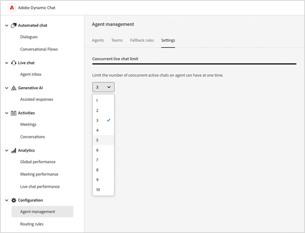

# Aanvullende informatie over Dynamic Chat {#dynamic-chat-release}

De versies van Adobe Dynamic Chat werken op een ononderbroken leveringsmodel dat voor een scalable benadering van eigenschapplaatsing toestaat. Soms zijn er meerdere releases per maand, dus raadpleeg je regelmatig voor de meest actuele informatie.

De standaardpagina van de Nota&#39;s van de Versie voor Marketo Engage [&#x200B; kan hier &#x200B;](/help/marketo/release-notes/current.md){target="_blank"} worden gevonden.

## Release van juni 2025 {#june-2025-release}

**Releasedatum: dinsdag 30 juni 2025**

### Logica Revamp routeren {#routing-logic-revamp}

Wij hebben de levende praatje verpletterend logica in Dynamic Chat vernieuwd om intelligenter en voorspelbaarder betrokkenheidsgedrag over alle verpletterende types (Rekening, Douane, Team, en Round Robin) te verzekeren. De nieuwe logica vereenvoudigt het verpletteren van stromen en verbetert reservebehandeling wanneer de agenten niet beschikbaar zijn.

#### Zeer belangrijke Verbeteringen in het Verpletteren van Gedrag

* **tot twee verbindingspogingen per zitting**

   * Het systeem zal proberen om met maximaal twee agenten (hoogstens) te verbinden, maar strikt binnen de primaire verpletterende regel.

   * Als een agent beschikbaar is maar niet antwoordt (b.v., leidt of mist de praatje), zal het systeem proberen om met een verschillende agent van de zelfde pool te verbinden.

   * De fallback-logica (zoals Round Robin) wordt alleen geactiveerd als er geen in aanmerking komende agents zijn gevonden tijdens de eerste resolutie, niet om het opnieuw te proberen na een mislukte betrokkenheid.

* **Verpletterend regel-Specifiek Gedrag**

##### —Het Verpletteren van de Rekening—

Als het e-maildomein van een bezoeker wordt toegewezen aan een bekende account, krijgt de toegewezen agent altijd de prioriteit.

Als de agent beschikbaar is, wordt het praatje verpletterd aan hen direct.

Als de agent niet beschikbaar is, het systeem:

* Probeert geen andere agent, zelfs als Round Robin is ingeschakeld als fallback.

* In plaats daarvan:

   * Toont de vergaderingskalender van de in kaart gebrachte agent (als toegelaten),
-of-
   * Hiermee keert u terug naar een standaardbericht (worst case).

De kaart-vlakke verpletterende regel (b.v. Team, Douane) wordt slechts overwogen als het Verpletteren van de Rekening niet in aanmerking komt (geen passend domein of agent).

##### —Aangepast/teamroutering—

Deze regels kunnen meerdere in aanmerking komende agenten teruggeven.

Als de eerste beschikbare agent niet in dienst neemt, zal het systeem één meer agent van de zelfde lijst proberen.

Round Robin fallback wordt niet geactiveerd alleen omdat één agent niet reageert.

Als geen van beide agenten aangaat:

* Het systeem toont de agenda van de eerste beproefde agent (indien toegelaten),
-of-
* Hiermee geeft u het standaardfallback-bericht weer.

##### —Round Robin Routing—

Wanneer gebruikt als primaire verpletterende regel, het systeem:

* Probeert de eerste beschikbare agent van de ronde robin pool in dienst te nemen.

* Als de eerste agent niet antwoordt, probeert het met de volgende beste geschikte agent opnieuw.

Als Round Robin wordt gebruikt als fallback, wordt deze alleen geactiveerd als er geen agents zijn gevonden op basis van de primaire regel.

##### Visitor Experience Flow

Het systeem controleert of het Verpletteren van de Rekening toepasselijk is.

* Als ja en de agent beschikbaar is, verbindt het onmiddellijk.

* Als de agent niet in aanmerking komt of niet beschikbaar is, gaat het aan kaart-niveau dat regel verplettert.

De kaart-vlakke verpletterende regel (Douane, Team, Ronde Robin) wordt geëvalueerd.

* De in aanmerking komende agenten worden gecontroleerd op beschikbaarheid (toestemmingen, status).

* Het systeem treedt één agent in dienst, en probeert indien nodig, een tweede agent van de zelfde regel.

* Als geen betrokkenheid slaagt, wordt fallback-logica toegepast:

   * terugvaldatum kalender (indien ingeschakeld),
-of-
   * Standaardbericht.

De ronde reserve van Robin wordt slechts overwogen wanneer geen in aanmerking komende agenten van de primaire verpletterende regel worden gevonden, niet wanneer de individuele agenten er niet in slagen te antwoorden.

##### Gebruiksscenario’s

_&#x200B;**Verpletterende Rekening**&#x200B;_

<table><thead>
  <tr>
    <th>Type</th>
    <th>Voorbeeld</th>
    <th>Resultaat</th>
  </tr></thead>
<tbody>
  <tr>
    <td>Ideaal</td>
    <td>De domeinkaarten van de bezoeker aan een rekening; de in kaart gebrachte agent heeft toegelaten levende praatje en is beschikbaar</td>
    <td>Chat maakt rechtstreeks verbinding met de toegewezen agent</td>
  </tr>
  <tr>
    <td>Fallback (Round Robin)</td>
    <td>Toegewezen agent is niet beschikbaar, Round Robin fallback is ingeschakeld</td>
    <td>Het systeem selecteert één beschikbare agent via Round Robin en verbindt hen </td>
  </tr>
  <tr>
    <td>Geen valagent</td>
    <td>De toegewezen agent is niet beschikbaar, geen Round Robin fallback; het boeken van de vergadering wordt toegelaten</td>
    <td>Het systeem toont in kaart gebrachte agentenkalender of toont een standaardreservebericht</td>
  </tr>
</tbody></table>

_&#x200B;**Douane Verpletterend**&#x200B;_

<table><thead>
  <tr>
    <th>Type</th>
    <th>Voorbeeld</th>
    <th>Resultaat</th>
  </tr></thead>
<tbody>
  <tr>
    <td>Ideaal</td>
    <td>De logica van de douane lost een lijst van agenten op; de eerste agent is beschikbaar en keurt praatje goed.</td>
    <td>Chat verbindt met de eerste agent.</td>
  </tr>
  <tr>
    <td>Fallback (Round Robin)</td>
    <td>De regel van de douane lost geen agenten op, wordt de Round Robin fallback toegelaten.</td>
    <td>Het systeem selecteert één beschikbare agent via Round Robin en verbindt hen.</td>
  </tr>
  <tr>
    <td>Geen valagent</td>
    <td>Twee agenten opgelost; noch keurt praatje goed, reserve die aan vergaderingskalender wordt geplaatst.</td>
    <td>De eerste uitgeprobeerde kalender van de agent wordt getoond of het standaardreservebericht wordt getoond.</td>
  </tr>
</tbody></table>

_&#x200B;**Team dat**&#x200B;_ verplettert

<table><thead>
  <tr>
    <th>Type</th>
    <th>Voorbeeld</th>
    <th>Resultaat</th>
  </tr></thead>
<tbody>
  <tr>
    <td>Ideaal</td>
    <td>Het team omvat agenten met levende praatje; de eerste beschikbare agent keurt de chat goed.</td>
    <td>Chat verbindt met die agent.</td>
  </tr>
  <tr>
    <td>Fallback (Round Robin)</td>
    <td>Er is geen teamagent beschikbaar en Round Robin fallback is ingeschakeld.</td>
    <td>Het systeem selecteert en verbindt met één agent van Round Robin pool.</td>
  </tr>
  <tr>
    <td>Geen valagent</td>
    <td>Twee beschikbare agenten, maar geen van beiden verbindt; de terugval van de kalender toegelaten.</td>
    <td>Het eerste beproefde kalender van de agent wordt getoond of het reservebericht wordt teweeggebracht.</td>
  </tr>
</tbody></table>

_&#x200B;**Rond Robin die**&#x200B;_ verplettert

<table><thead>
  <tr>
    <th>Type</th>
    <th>Voorbeeld</th>
    <th>Resultaat</th>
  </tr></thead>
<tbody>
  <tr>
    <td>Ideaal</td>
    <td>Round Robin-pool heeft meerdere agents; de tweede agent accepteert chat nadat dit niet het geval is.</td>
    <td>Chat verbindt met tweede agent.</td>
  </tr>
  <tr>
    <td>Fallback (Round Robin)</td>
    <td>Geen agenten beschikbaar in de Ronde Groep van Robin; vergaderingskalender wordt toegelaten.</td>
    <td>De kalender wordt getoond voor eerste agent in de lijst (indien gevormd), of het terugvalbericht getoond.</td>
  </tr>
  <tr>
    <td>Geen valagent</td>
    <td>Geen beschikbare agenten; fallback wordt onbruikbaar gemaakt.</td>
    <td>Het statische terugvalbericht wordt getoond aan de bezoeker.</td>
  </tr>
</tbody></table>

### Pulsmelding {#pulse-notification}

Wanneer een bezoeker om met een agent verzoekt te verbinden, verstrekken wij in-app, browser bericht aan de agent. Maar soms missen agenten deze chats.

Met deze release krijgt de live agent een e-mail, Slack, in-app en browsermelding wanneer een nieuwe bezoeker geïnteresseerd is in chatten.

1. Voor uw homepage van Adobe Experience Cloud, klik het pictogram van de Rekening en selecteer **Voorkeur**.

   

1. De rol neer aan _Berichten_ en maakt uw gewenste selecties van Dynamic Chat.

   

>[!NOTE]
>
>Inhoud voor een Pulse-melding kan hetzelfde zijn als de inhoud voor browsermeldingen in de app.

## Release april/mei 2025 {#apr-may-25-release}

### Geluid bericht {#message-notification-sound}

U hebt nu de optie om een geluid voor de bezoeker toe te laten telkens als het praatje in een zitting wordt teweeggebracht. Er zijn meerdere geluiden waaruit u kunt kiezen.

### Podberichten inschakelen op mobiele apparaten {#enable-poke-messages-on-mobile}

&quot;Poke,&quot; dat de openingsvraag naast het chatpictogram weergeeft zonder dat de bezoeker erop moet klikken om deze te zien, is nu een optie die bezoekers die een mobiel apparaat gebruiken, kunnen inschakelen.

### Standaardinstelling voor alternatieven {#default-fallback-update}

Voor om het even welke douaneregels/Teams als Levend Chat kaart-als geen agenten beschikbaar zijn (of de praatje kan niet verbinden), zal het terug naar Ronde Robin voor beschikbare agenten vallen (allen die op dat ogenblik beschikbaar zijn ongeacht welke verpletterende logica/regel in de stroom werd gezet).

### Integratie op basis van vereisten {#demandbase-integration}

De veeleisende gebruikers kunnen de eigenschappen van de de gebruikersbenaming van de Demandbase voor dialoog het richten, voorwaardelijke branding, en douane het verpletteren in Dynamic Chat gebruiken.

## Release september/oktober 2024 {#sep-oct-release}

### Verbeterde live chatanalyse {#enhanced-live-chat-analytics}

Er zijn verschillende verbeteringen aangebracht in het dashboard Analytics, waaronder:

* Totaal aangevraagd aantal actieve chatberichten: aantal bezoekers dat is aangevraagd voor een &quot;chat met agent&quot;

* Totaal verbonden livechat: aantal verbonden bezoekers vs. totaal aangevraagd voor een &quot;chat met agent&quot;

* Totaal aantal gemiste livechatverzoeken: aantal onbeheerde bezoekers versus totaal aangevraagd voor een &quot;chat met agent&quot;

* Gemiddelde chatlengte in minuten: analyseren &quot;gemiddelde chatlengte&quot; tussen bezoekers en uw agenten

* Gemiddelde Responstijd van de agent in seconden: analyseer de &quot;gemiddelde tijd die door agenten wordt genomen&quot;om op hun levende chat Q&amp;A te antwoorden

* Dagelijks dashboard: livechatverzoeken zijn met succes verbonden, livechatverzoeken zijn overgeslagen, sorteren en filteren recente live chatactiviteiten

### Gesprek {#conversation-scoring}

Kwaneer uw lood op de kwaliteit van hun praatjeinteractie en gebruik die metrisch als Trigger/Filter in de Slimme Campagnes van Marketo Engage. Gebruik de nieuwe attribuut _gespreksscore_ op de volgende activiteiten:

* Bij een dialoogvenster
* Behoefte aan een gespreksstroom
* Betrokken bij een agent

**Dingen aan nota te nemen:**

* De muziekwaarde ligt tussen 0, 1, 2 en 3 (standaardwaarde is null)

* Wanneer het gesprek wordt voltooid of gelaten vallen, kan de het schrapen waarde niet worden uitgegeven

* Een score instellen:

   * In de agent inbox - tijdens een levende praatje, kan de agent een score voor het gesprek bijwerken of plaatsen, dat in de gespreksactiviteit wordt opgeslagen

   * In de stroomontwerper - in de doelkaart, kan de gebruiker een score voor het gesprek bijwerken of plaatsen

### Nieuwe logica voor het maken van leads {#new-lead-creation-logic}

Als een lead een formulier invult met de e-mail `abc@test.com` en als xyz wordt gekookt, wordt later hetzelfde formulier ingevuld met de e-mail `def@test.com` , wordt een nieuwe persoonrecord gemaakt, maar wordt cookie xyz gekoppeld aan de nieuwe persoon en verwijderd van de persoon `abc@test.com` .

Dus wanneer een bezoeker met cookie abc op een pagina landt en een e-mailadres opgeeft als `abc@test.com` :

<table><thead>
  <tr>
    <th>Bezoeker</th>
    <th>Cookie</th>
    <th>E-mail verstrekt</th>
    <th>Verwacht gedrag</th>
  </tr></thead>
<tbody>
  <tr>
    <td>Anoniem</td>
    <td>abc</td>
    <td>Is niet aanwezig in database</td>
    <td>Een nieuwe persoon maken</td>
  </tr>
  <tr>
    <td>Anoniem</td>
    <td>abc</td>
    <td>Bestaat in database</td>
    <td>Een persoon samenvoegen</td>
  </tr>
  <tr>
    <td>Anoniem</td>
    <td>xyz</td>
    <td>Bestaat in database</td>
    <td>Een persoon samenvoegen</td>
  </tr>
  <tr>
    <td>Bekende persoon</td>
    <td>abc</td>
    <td>Zelfde als bestaande persoon</td>
    <td>Personen bijwerken</td>
  </tr>
  <tr>
    <td>Bekende persoon</td>
    <td>abc</td>
    <td>Verschil met bestaande persoon</td>
    <td>Als er al een bekende persoon bestaat, verzendt u het cookie en lost u dat profiel op. Als er geen persoon bestaat met deze e-mail, maakt u een nieuwe persoonrecord en draagt u de cookie over</td>
  </tr>
  <tr>
    <td>Bekende persoon</td>
    <td>xyz</td>
    <td>Zelfde als bestaande persoon</td>
    <td>Nieuwe cookie toevoegen aan dezelfde persoon</td>
  </tr>
  <tr>
    <td>Bekende persoon</td>
    <td>xyz</td>
    <td>Verschil met bestaande persoon</td>
    <td>dit scenario is niet mogelijk alsof het een nieuwe cookie is van   standaard beschouwd als een nieuw anoniem profiel</td>
  </tr>
</tbody></table>

### Optie om lettertype over te nemen {#option-to-inherit-font}

U kunt de chatbot nu inschakelen om het lettertype rechtstreeks over te nemen van de webpagina waarop het wordt gehost, in plaats van het merklettertype te beheren in Dynamic Chat. Wanneer u deze optie inschakelt, neemt de chatbot het lettertype dat is gedefinieerd op de `<body>` -tag van de pagina.

### Integratie van de eisen met Dynamic Chat {#demandbase-integration-with-dynamic-chat}

De veeleisende gebruikers kunnen hun eigen vergunning van Demandbase brengen en de integratie activeren. De attributen van de de vraagbasis van het gebruik voor dialoog het richten, voorwaardelijke branding, en douane het verpletteren.

De resolutie van deze kenmerkwaarden ten opzichte van een persoon zou in real time worden uitgevoerd en wordt opgeslagen in het respectievelijke persoonlijke profiel.

### Geoptimaliseerde de ladingstijd van de gespreksstroom {#optimized-conversation-flow-load-time}

Om de gebruikerservaring te verbeteren, wordt nu een shimmer lader getoond in plaats van een lege ruimte terwijl de Omroepstroom laadt.

**vóór**

**na**

## Release van augustus 2024 {#august-release}

**Releasedatum: zaterdag 23 augustus 2024**

### Aangepaste indeling voor uw gespreksberichten {#custom-format-conversation-messages}

De ontwerpers van de stroom steunen nu [&#x200B; het opnemen van HTML &#x200B;](/help/marketo/product-docs/demand-generation/dynamic-chat/automated-chat/stream-designer.md#create-a-stream){target="_blank"} om de blik en het gevoel van uw gesprekken aan te passen.

### Chatbot naar beneden schuiven {#chatbot-scroll-to-bottom}

Er is een pictogram toegevoegd aan het chatvak zodat webbezoekers direct naar het laatste bericht kunnen gaan. Dit helpt bezoekers die door de tekst scrollen om aan het gesprek snel terug te komen.

### Kernpulsmeldingen {#core-pulse-notifications}

De gebruikers krijgen nu een [&#x200B; e-mailbericht &#x200B;](/help/marketo/product-docs/demand-generation/dynamic-chat/live-chat/live-chat-overview.md#failed-action-notifications){target="_blank"} wanneer een vergadering het boeken of een levende praatje ontbreekt.

### Ondersteuning voor meerdere gesprekken {#support-for-multiple-conversations}

De chatbot ondersteunt nu meerdere conversaties. Websitebezoekers kunnen op verschillende pagina&#39;s tegelijk verschillende gesprekken voeren, waarbij ze van elkaar kunnen wisselen.

### Standaardsortering voor inhoud {#default-sorting-for-content}

Door gebrek, worden uw gesprekslogboeken, onbeantwoorde vragen, en de lijsten van de vraaggeneratie gesorteerd door gecreeerde datum (van meest recente aan oudste).

### Resolutie van lead in realtime {#real-time-lead-resolution}

Tijdens een gesprek met een anonieme lead en een e-mailid is opgegeven, lossen we op of er een bekende lead-record met die e-mailid bestaat en gebruiken we die record voor personalisatie in real-time. Als wij veelvoudige verslagen vinden, voegen wij hen in real time samen. Dit gedrag wordt geïmplementeerd voor zowel Dialoogvensters als Conversationele stromen.

### Logbestanden synchroniseren zonder cookies van Marketo Engage {#syncing-leads-without-cookies}

Eerder, toen de Marketo Engage-synchronisatie werd geactiveerd, synchroniseerde Dynamic Chat alleen bekende leads met een of meer cookie-id&#39;s uit Marketo Engage. Alle bekende leads (cookie-id aanwezig of niet) worden nu gesynchroniseerd naar Dynamic Chat en kunnen worden gebruikt voor het personaliseren van gesprekken.

### Aanvullende bezoekersgegevens doorgeven aan Conversatiestromen {#pass-additional-visitor-data}

Als u bezoekersgegevens vastlegt via andere kanalen, zoals formulieren of aanmelding, kunt u deze gegevens nu rechtstreeks doorgeven aan Dynamic Chat.

### Gereviseerde afgeleide gegevens {#refreshed-inferred-data}

De meeste gesprekken op een website zijn met anonieme bezoekers. U kunt hen nog door gevolgde gegevens richten, die op bezoekers IPs baseert. Wij hebben ons gegevensbestand van IPs en respectieve afgeleide gegevens bijgewerkt die nu vier keer meer IPs steunen.

### Geluid toegevoegd aan browsermelding van agent {#sound-added-to-agent-browser-notification}

Wanneer een levende praatje aan een agent wordt toegewezen, krijgen zij een browser bericht. Maar af en toe zien ze ze niet. Wij hebben het geluid van het a [&#x200B; bericht &#x200B;](/help/marketo/product-docs/demand-generation/dynamic-chat/live-chat/live-chat-overview.md#when-a-live-chat-is-routed-to-an-agent){target="_blank"} toegevoegd helpen gemiste berichten verhinderen vooruit te gaan.

### Leadprofiel bijwerken tijdens livechat {#update-lead-profile-during-live-chat}

Tijdens een live chat willen de agenten informatie over de bezoeker vastleggen en het respectieve profiel bijwerken. Er is nu een optie om kenmerkwaarden van lood en bedrijfvoorwerpen bij te werken.

## Release van juni 2024 {#june-release}

**Releasedatum: vrijdag 6 juni 2024**

### Conversale stroomkaart {#conversational-flow-card}

Gestroomlijnd veelvoudige stappen in een stroom binnen uw Dialogen door de Conversationele kaart van de Stroom te gebruiken.

Voorbeeld: Als uw doel is registraties voor uw webinar via veelvoudige Dialogs te drijven, zou u de zelfde stroom over alle Dialogen moeten opnieuw creëren die dat doel hebben. En als u om het even welk detail moet bijwerken, zou u elke individuele Dialoog één voor één moeten uitgeven. Dat is niet langer het geval, dankzij de Conversational Flow Card.

Naast het opnieuw gebruiken van stromen over veelvoudige Dialogen, kunt u de zelfde overgangsstroom ook gebruiken om door andere kanalen, zoals vormen en het Landing Pagina&#39;s teweeg te brengen.

### Gebruiksbeperkingen {#usage-limits}

Op de pagina Gebruikslimieten wordt belangrijke informatie weergegeven, zoals pakketdetails en de status van uw gebruikslimiet.

## Release van mei 2024 {#may-release}

**Releasedatum: donderdag 15 mei 2024**

### Reactiebibliotheek vooraf goedgekeurd {#pre-approved-response-library}

[&#x200B; creeer een marketing-goedgekeurde bibliotheek &#x200B;](/help/marketo/product-docs/demand-generation/dynamic-chat/generative-ai/response-library.md){target="_blank"} van AI-Gegenereerde vraag en antwoorden om opstelling generatieve AI praatje in notulen te helpen.

### Onbeantwoorde vragen {#unanswered-questions}

[&#x200B; Gebruik een bewaarplaats van onbeantwoorde vragen &#x200B;](/help/marketo/product-docs/demand-generation/dynamic-chat/generative-ai/unanswered-questions.md){target="_blank"} van vorige gesprekken om nieuwe vooraf goedgekeurde reacties te produceren die een reactiebibliotheek met de recentste informatie handhaven.

### Overzichten van gesprekken {#conversation-summaries}

[&#x200B; geef verkoopagenten samengevatte gesprekken &#x200B;](/help/marketo/product-docs/demand-generation/dynamic-chat/live-chat/agent-inbox.md#conversation-summary){target="_blank"} met inbegrip van inzichten over zeer belangrijke besprekingsonderwerpen vóór vergaderingen om prep tijd en betere wapenverkoopagenten met de recentste informatie te verminderen.

### GenAI-sneltoetsen {#genai-sales-shortcuts}

[&#x200B; verstrek levende praatjeagenten van snellere manieren &#x200B;](/help/marketo/product-docs/demand-generation/dynamic-chat/live-chat/agent-inbox.md#shortcuts){target="_blank"} om tot AI-Gegenereerde reacties toegang te hebben, bestaande geproduceerde reacties uit te geven en naar extra inhoud te zoeken om naar kopers tijdens gesprek te verzenden.

### Gesprek-hulp {#conversation-assist}

De verkoopagenten van de hulp antwoorden correct tijdens levende gesprekken gebruikend reacties vooraf goedgekeurd door uw marketing team.

### Gesprek {#conversation-nudges}

Zet webbezoekers onder druk met een call-to-action om gesprekken tot een goed einde te brengen.

## Release van april 2024 {#april-release}

**Releasedatum: woensdag 23 april 2024**

### Conversatiestromen zijn nu beschikbaar voor alle gebruikers {#conversational-flows-available-to-all-users}

Maak uw formulieren en bestemmingspagina&#39;s conversationeler en verkort de verkooptrechter door gekwalificeerde leads toe te staan om een vergadering of een chat met Verkoop onmiddellijk na een formulierverzending met Conversational Forms te boeken, nu volledig beschikbaar &#42; voor alle gebruikers van Dynamic Chat.

_&#42;eerder beschikbaar als proefeigenschap met 100 levenovereenkomsten. De overeenkomsten van de Stroom van het gesprek zullen nu op de maandelijkse grens van 250 geëngageerde gesprekken voor gebruikers op het Uitgezochte pakket tellen._

### Callback-functies {#callback-functions}

[&#x200B; Callback functies &#x200B;](/help/marketo/product-docs/demand-generation/dynamic-chat/setup-and-configuration/callback-functions.md){target="_blank"} staan u toe om de analysegebeurtenissen van Dynamic Chat in externe systemen, zoals Adobe Analytics of Google Analytics te verzamelen, aangezien de bezoekers met de gesprekken van Dynamic Chat in dienst nemen. U kunt Dynamic Chat-analysegebeurtenissen inschakelen door een callback met de API te registreren om naar de gebeurtenissen te luisteren. Hierdoor kunt u een meer holistische weergave van uw Dynamic Chat-betrokkenheid hebben, aangezien deze betrekking heeft op andere belangrijke gegevens, zoals webverkeer.

### Beschikbaarheidsvoorwaarden voor actieve agent toegevoegd aan voorwaardelijke vertakking {#live-agent-availability-conditional-branching}

Naast native en aangepaste Marketo Engage-velden kunt u nu voorwaardelijke vertakking gebruiken om vertakkingen te maken op basis van de beschikbaarheid van agents. Dit is handig als u bezoekers alleen de optie wilt geven om met een actieve agent te spreken als er live agents beschikbaar zijn.

### Voorwaarde voor slimme lijst toegevoegd aan voorwaardelijke vertakking {#smart-list-condition}

Met de toevoeging van de nieuwe voorwaarde van de Slimme Lijst van Marketo Engage in voorwaardelijk vertakking, kunt u takken tot stand brengen die op reeds bestaand publiek worden gebaseerd u reeds in Marketo Engage eerder dan het bepalen van publiek vertakkende voorwaarden in Dynamic Chat hebt gecreeerd.

### Voorwaardelijke vertakking voor conversie-stromen {#conditional-branching-for-conversational-flows}

Eerder dit jaar hebben we voorwaardelijke vertakking voor Dialogen uitgebracht en nu kunt u ook profiteren van voorwaardelijke vertakking in Conversationele Stroom! Met voorwaardelijke vertakking kunt u vertakkingen in uw flow maken op basis van verschillende voorwaarden.

### Live chatten over conversatiestromen {#live-chat-for-conversational-flows}

We hebben in 2023 live chatfunctionaliteit voor dialoogvensters uitgebracht en nu kunt u ook live chatsopdrachten toevoegen aan uw conversatiestromen. Als u Conversational Flows gebruikt met uw Marketo Engage-formulieren, kunt u bevoegde bezoekers nu toestaan te chatten met een liveagent direct na het verzenden van het formulier.

### Recente Marketo Engage-activiteiten in Agent Inbox {#recent-marketo-engage-activities-in-agent-inbox}

We hebben recente Marketo Engage-activiteiten toegevoegd aan de sectie Recente activiteiten van de Agent Inbox. Wanneer een bezoeker van de site een verzoek indient om te chatten met een agent, kan de agent snel zien of de bezoeker onlangs een van de volgende Marketo Engage-activiteiten heeft uitgevoerd (laatste 25 activiteiten):

* E-mail geopend
* Bezochte webpagina
* Formulier invullen
* Interessant moment

### De verbindingsstatus van de kalender in het Beheer van de Agent {#calendar-connection-status-in-agent-management}

Beheerders kunnen nu gemakkelijk zien welke agents met boekingsmachtigingen voor vergaderingen hun agenda&#39;s in Dynamic Chat hebben verbonden. Op deze manier kunt u ervoor zorgen dat uw volledige verkoopteam is verbonden en klaar is voor het accepteren van vergaderaanvragen van Dynamic Chat.

### Minimale opzegging in configuratie van de agentenkalender {#minimum-notice-setting-in-agent-calendar-configuration}

De gebruikers rapporteerden dat de Webbezoekers vergaderingen op hun kalender met slechts 10 minuten van gevorderde kennisgeving boeken, zodat introduceerden wij een minimumbericht plaatsend in de configuratie van de agentenkalender en plaatsten de standaardlood tijd aan 24 uren.

### Gebruikersgedrag toevoegen/verwijderen bijgewerkt {#add-remove-user-behavior-updated}

Sommige gebruikers verklaarden dat zij problemen hadden met het toevoegen en verwijderen van agenten in Dynamische praatje, zodat maakten wij sommige veranderingen om deze kwesties te behandelen.

Wanneer een gebruiker aan Admin Console met levende praatje of vergadering het boeken toestemming wordt toegevoegd, zullen zij onmiddellijk in de lijst van het Beheer van de Agent verschijnen en beschikbaar zijn om aan Dialogen, de Omroepende Stromen, het verpletteren van regels, en teams toe te voegen.

Wanneer een gebruiker met het boeken van de vergadering of de levende praatjetoestemmingen wordt verwijderd uit Admin Console, zullen zij onmiddellijk worden verwijderd uit Dynamic Chat, zullen niet meer voor levende praatje of vergadering het verpletteren beschikbaar zijn, en zullen niet meer tellen tegen vergunningsgrenzen.

### Verbeterde prestaties van het conversatieniveau {#improved-conversation-level-report-performance}

De rapporten Individuele dialoog en Conversational Flow Level zijn nu prestatiever en nauwkeuriger. Eerder konden dialoograpporten enkele seconden duren om te laden en waren de gegevens af en toe inconsistent met algemene prestatierapporten. De afzonderlijke dialoograpporten worden nu meteen geladen en de gegevens worden altijd uitgelijnd met algemene rapportgegevens.

### Machtigingsupdates {#permission-updates}

We schoonmaakten de machtigingsstructuur en namen in Adobe Admin Console om machtigingsbeheer intuïtiever te maken.

* De categorie &#39;Gesprek-beheer&#39; heet nu &#39;Gesprek&#39;
* De categorie &quot;vergaderingen&quot; heet nu &quot;Activiteiten&quot;
* De categorie &#39;Instellingen agent&#39; wordt nu &#39;Agenten&#39; genoemd
* De categorie &#39;Beheerinstellingen&#39; wordt nu &#39;Configuratie&#39; genoemd
* De categorie &#39;Live Chat&#39; is verwijderd en alle rechten voor live chat zijn verplaatst naar de categorie &#39;Agenten&#39;

### Steun voor hyperlinks in Agent Inbox {#support-for-hyperlinks-in-agent-inbox}

Wanneer live chatagents nu URL&#39;s delen met bezoekers in de chat, worden deze URL&#39;s aan hyperlinks gekoppeld, zodat bezoekers er gewoon op kunnen klikken om naar de pagina te navigeren, in plaats van de URL in hun browser te kopiëren en te plakken.

### Ga zeer belangrijk gedrag in dat in Agent Inbox wordt bijgewerkt {#enter-key-behavior-updated-in-agent-inbox}

Wij veranderden het terugkeer zeer belangrijke gedrag in Agent Inbox, zodat zal het drukken van de Terugkeer of Enter sleutel uw bericht verzenden en het drukken van Shift+Enter zal tot een lijnonderbreking leiden.

### Pagina met afgeronde lijnen verwijderd {#round-robin-page-removed}

Maak je geen zorgen! Ronde robin het verpletteren is nog volledig functioneel en werkt de zelfde manier het altijd heeft. Wij hebben enkel de pagina verwijderd die een vaak onnauwkeurige lijst van agenten en hun orde in de ronde robin toonde die rij verplettert.

Toen wij Dynamic Chat in 2022 vrijgaven, was er geen steun voor levende praatje, slechts vergaderingshet boeken, en de ronde robin die pagina verplettert werd ontworpen met enkel vergaderingshet in mening boeken. Met de introductie van levende praatje vorig jaar, werd de ronde robin pagina verouderd aangezien het niet nauwkeurig de complexere aard van ronde robin weerspiegelde die tussen agenten met zowel vergaderingshet boeken als levende praatjetoestemmingen verplettert. We hebben een aantal verschillende opties onderzocht om dit probleem aan te pakken, maar uiteindelijk hebben we besloten dat het volledig verwijderen ervan de beste optie was om verwarring te minimaliseren.

## Release van februari 2024 {#february-release}

**Releasedatum: vrijdag 22 februari 2024**

### Pagina Conversaties {#conversations-page}

De nieuwe pagina van Gesprek voorziet u van één-stopshop om transcripties voor alle (geautomatiseerde en levende) gesprekken te bekijken die voor uw instantie, van zowel bekende als anonieme lood voorkwamen, die u van betere zichtbaarheid voorzien in hoe uw klanten met uw Dialogen, de Stromen van het Gesprek, en levende agenten in dienst nemen.

### Het datumbereik in het algemene dashboard is toegenomen van 90 dagen tot 24 maanden {#date-range-in-global-dashboard}

U hebt het gevraagd en we hebben het afgeleverd. U kunt nu Dynamic Chat-betrokkenheidsgegevens voor maximaal twee jaar bekijken in alle analytische dashboards.

### Voorwaardelijke vertakking in dialoogvensters {#conditional-branching-in-dialogues}

Met voorwaardelijke vertakking kunt u vertakkingen maken in uw dialoogvenster op basis van verschillende voorwaarden. Nu kunt u verschillende inhoud presenteren aan verschillende personen in dezelfde dialoog op basis van de kenmerken van leads en bedrijven in Marketo Engage.

## Release van januari 2024 {#january-release}

**Releasedatum: donderdag 24 januari 2024**

### Gelijktijdige instelling voor chatlimiet in agentbeheer {#Concurrent-live-chat-limit-setting}

Standaard kan elke live chatagent in uw instantie maximaal vijf live chatsessies tegelijk uitvoeren. Wij introduceerden een nieuwe het plaatsen in agentenbeheer die u toestaat om deze grens van 1 tot 10 aan te passen.

