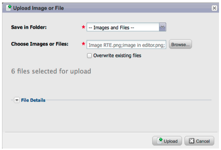
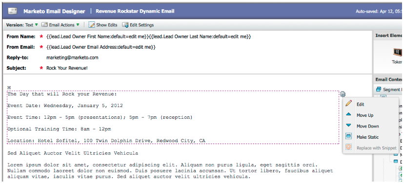

# Opmerkingen bij de release: april 2012 {#release-notes-april}

## Segmentatiefilters en triggers {#segmentation-filters-and-triggers}

Doet u dezelfde groep leads consistent als doel? Als zo, gebruik segmentatie in uw slimme lijsten voor het richten van lood. Met segmentatie, wordt uw volledige loodgegevensbestand altijd gesegmenteerd en het kan over uw programma&#39;s voor consistentie opnieuw worden gebruikt. De resultaten van de segmentatie worden snel getrokken omdat zij niet de slimme lijst vereisen om op het tijdstip van het verzoek te lopen.

## Externe waarden invoegen in e-mailinhoud en andere stappen in de stroom via uitgebreide API-mogelijkheden {#insert-external-values-into-email-content-and-other-flow-steps-through-expanded-api-capabilities}

* Met de API voor aanvraagcampagnes kunt u nu waarden voor Mijn tokens voor die specifieke campagne invoeren. Dit is vooral handig voor het vullen van e-mailinhoud via de API
* Nieuwe API&#39;s voor uploaden naar lijst en plannen voor campagne ondersteunen het bovenstaande voor lijsten met leads en batchcampagnes.

## Eenvoudiger bevestigingsberichten voor [!DNL GoToWebinar] en [!DNL WebEx] (Adobe Connect en [!DNL ON24] binnenkort beschikbaar!) {#easier-confirmation-emails-for-gotowebinar-and-webex-adobe-connect-and-on-coming-soon}

De URL voor bevestiging is vereenvoudigd door een lidtoken te maken waarmee de unieke URL voor registratiebevestiging voor elke lead wordt weergegeven. U hoeft deze URL niet meer met andere tokens te maken. Deze is momenteel beschikbaar voor [!DNL GoToWebinar] - en [!DNL WebEx] -klanten en is beschikbaar voor Adobe Connect en [!DNL ON24] in onze volgende release.

## Upload Meerdere afbeeldingen en bestanden met één klik! {#upload-multiple-images-and-files-with-a-single-click}

Bespaar tijd en bespaar efficiënter bij het importeren van afbeeldingen en bestanden naar Marketo! Als u [!DNL Firefox] of [!DNL Google Chrome] gebruikt, kunt u meerdere bestanden selecteren en deze in één keer uploaden. Hoewel het aantal bestanden dat u kunt uploaden niet beperkt is, is de maximale afzonderlijke bestandsgrootte 50 MB.

Opmerking: deze functie wordt momenteel niet ondersteund door [!DNL Internet Explorer] vanwege beperkingen van de browser.

## Tekst in een e-mail verplaatsen {#move-text-in-an-email}

U kunt tekstblokken in een e-mail opnieuw ordenen. Selecteer een tekstblok in de teksteditor. Als u op het bewerkingspictogram klikt, ziet u de optie om het blok omhoog of omlaag te verplaatsen.

## [!DNL Salesforce] Verwijzingen verwijderd voor niet- [!DNL Salesforce] gebruikers {#salesforce-references-removed-for-non-salesforce-users}

Als u uw abonnement niet synchroniseert met [!DNL Salesforce] , ziet u dat alle mappen en stroomhandelingen die naar [!DNL Salesforce] verwijzen, worden verwijderd.

## Marketo Revenue Cycle Analytics {#marketo-revenue-cycle-analytics}

**Verbeterde Stages van de Gate in de Cyclus van de Opbrengst Modeler**

Staat gebruikers toe om een orde voor hun overgangsregels te bepalen.

