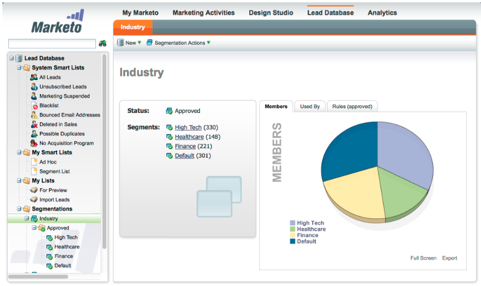

# Opmerkingen bij de release: jan/feb 2012 {#release-notes-jan-feb}

De volgende functies zijn opgenomen in de jan/feb-release. Raadpleeg de Marketo-editie voor informatie over de beschikbaarheid van functies. Kom terug na de release voor koppelingen naar gedetailleerde functiedocumentatie.

## Geavanceerde dynamische inhoud {#advanced-dynamic-content}

_Beschikbaar voor Pro en de Versies van de Onderneming_

Met geavanceerde dynamische inhoud kunt u aansprekende e-mailcommunicatie en bestemmingspagina&#39;s creëren relevant voor uw publiek zonder het moeten veelvoudige activa voor het zelfde bericht tot stand brengen. Met de bijgewerkte voorvertoningen kunt u elke unieke versie in één scherm bekijken.

## Segmentatie  {#segmentation}

_Beschikbaar voor Pro en de Versies van de Onderneming_

De segmentatie is een groep segmenten, die een gerichte groep individuen zijn aan wie u markt. De segmenten worden bepaald door regels die door filtercriteria gelijkend op slimme lijsten worden gedreven. Uw segmenten kunnen worden gebaseerd op demografische gegevens, zoals functie of industrie, of op gedrag zoals bezochte webpagina&#39;s of aangeklikte koppelingen.

## Fragmenten {#snippets}

_Beschikbaar voor Pro en de Versies van de Onderneming_

Sla rijke inhoud op die u telkens opnieuw kunt gebruiken om statische of dynamische e-mails en bestemmingspagina&#39;s te maken.

## PURL&#39;s {#purls}

_Beschikbaar voor Pro en de Versies van de Onderneming_

Het gebruiken van Persoonlijke URLs (PURLs) marketers kan nu contact-specifieke URLs tot stand brengen, om verpersoonlijking, meetbaarheid en liftreacties in multi-aanraak marketing programma&#39;s voor zowel direct mail als e-mailcampagnes te drijven.

## Ondersteuning van de EU-privacyrichtlijn {#eu-privacy-directive-support}

De nieuwe functies voor het naleven van de browserinstellingen &quot;Niet bijhouden&quot; omvatten de mogelijkheid om het bijhouden van gegevens voor anonieme leads uit te schakelen, waardoor naleving van de strengere EU-regels voor het bijhouden van privacy gemakkelijker wordt.

## Single Sign-On {#single-sign-on}

Organisaties kunnen nu een naadloze aanmelding bij de Marketo-toepassing ondersteunen met SAML 2.0 voor Single Sign-On via een bedrijfsportaal.

## Bijgewerkte e-mail- en Landingspagina-editors {#updated-email-and-landing-page-editors}

De E-mail- en Landing Page Editors zijn opnieuw ontworpen met een meer uitnodigende interface, intuïtieve navigatie en een aanzienlijk verbeterde gebruikerservaring, waaronder:

Een naast elkaar HTML- en tekstweergave

Van Naam, van E-mail, antwoord-aan (NIEUW) en Onderwerp worden getoond in de redacteur. Alle andere instellingen zijn toegankelijk via de knop Instellingen bewerken.

## Browserondersteuning {#browser-support}

* [!DNL Mozilla Firefox] 9.0
* [!DNL Google Chrome] 16
* [!DNL Microsoft Internet Explorer] 8 &amp; 9
* **Nota**: wij steunen niet meer [!DNL Internet Explorer] 7

## Programmabeheer {#program-management}

Het vereenvoudigde programmabeheer verbetert de bruikbaarheid met Token delete en de gemakkelijkere schrapping van Programma&#39;s.

## Abonnement op abonnementsrapport opzeggen {#unsubscribe-from-subscription-report}

Nu kunt u het abonnement op het abonnement rechtstreeks uit het rapport opzeggen!

## Munchkin-updates {#munchkin-updates}

Nieuwe Munchkin-aanroepen verkorten de laadtijden van webpagina&#39;s en bieden consistentere prestaties voor klikkoppelingsgebeurtenissen.

## De Analyse van de Kans van het programma (RCA slechts) {#program-opportunity-analysis-rca-only}

Begrijp marketing bijdrage aan individuele opportuniteitsopbrengst

## Analyse van de omzettingsfase van programma {#program-revenue-stage-analysis}

Vergroot insight in de snelheid van de programmavoorsprong door te begrijpen welke programma&#39;s de fast movers kregen

