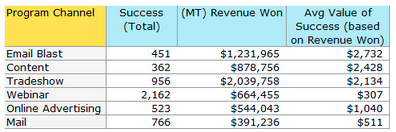
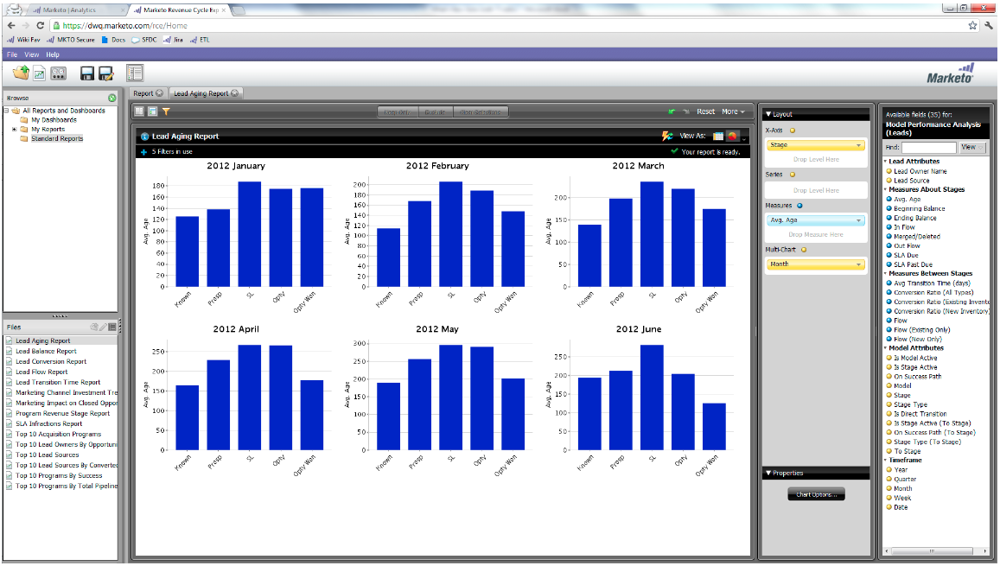

# Opmerkingen bij de release: juni 2012 {#release-notes-june}

## Verbeteringen in Marketo-hoofdbeheer {#marketo-lead-management-enhancements}

### Naam wijzigen {#rename}

U kunt de naam van uw slimme lijsten, statische lijsten en campagnes wijzigen. Als u deze elementen gebruikt in filters, triggers of stromen, wordt de naam daar ook automatisch bijgewerkt. U hebt de naam van uw e-mails, formulieren en mappen altijd kunnen wijzigen.

En, als bonus, verbeterden we het invoeren en bekijken van beschrijvende tekst voor activa.

## Veld-toewijzing importeren {#import-field-mapping}

We hebben het importeren van een lijst naar Marketo veel eenvoudiger gemaakt! Tijdens het importeren kunt u de naam van het Marketo-veld toewijzen aan de kolomkopnaam in het importbestand. Bovendien kunt u in [!UICONTROL Admin] aliasnamen instellen die zijn toegewezen aan de veldnaam in Marketo, zodat uw gebruikers altijd het juiste veld selecteren.

Als u door gaat met het importeren en toewijzen van velden, onthoudt Marketo de toewijzingen en geeft het deze weer tijdens het importeren, voor meer gebruiksgemak. En om het leven nog gemakkelijker te maken, kunt u de kopbal van de Waarde van de Steekproef klikken om de verschillende waarden te zien die op het gebied zouden bevolken. Zo weet u zeker dat u het juiste veld steeds in kaart brengt!

## [!UICONTROL Summary] Pagina voor slimme lijsten en statische lijsten {#summary-page-for-smart-lists-and-static-lists}

Heb je je ooit afgevraagd waar je lijsten worden gebruikt? Of wie heeft de lijst gemaakt of deze voor het laatst gewijzigd? De nieuwe overzichtspagina beschikbaar op Slimme Lijsten en statische lijsten, zal u van deze belangrijke details voorzien.

Op de bestaande overzichtspagina&#39;s van Programma en van de Campagne, hebben wij de Gemaakt Datum/Gebruiker en de Laatste Gewijzigde datum/de Informatie van de Gebruiker eveneens toegevoegd!

## [!UICONTROL Used By] voor Assets {#used-by-for-assets}

We hebben een nieuw tabblad toegevoegd aan de elementpagina&#39;s [!UICONTROL Summary] met de naam [!UICONTROL Used By] !

Voorbeeld: [!UICONTROL Used By] voor statische lijsten

## Rasterlijnen op de landingspagina {#landing-page-gridlines}

Door het toevoegen van rasterlijnen voor de landingspagina&#39;s wordt het uitlijnen van tekst, afbeeldingen en formulieren op de bestemmingspagina veel eenvoudiger. Schakel deze voor een bepaalde landingspagina in of uit en pas de breedte tussen de regels aan.

## Leads geblokkeerd van afschriften {#leads-blocked-from-mailings}

Wanneer het plannen van een campagne, kunt u op de verbinding klikken om de lijst van lood te zien die van uw post worden geblokkeerd.

## [!UICONTROL Wait] Stap - Token en mijn token leiden {#wait-step-lead-token-and-my-token}

In onze release van mei hebben we geavanceerde opties toegevoegd aan de stap [!UICONTROL Wait] flow. Met deze wijzigingen kunt u een werkdag, datum en tijd opgeven. In deze versie, voegden wij de capaciteit toe om een teken in de wachttijdstap te gebruiken. U kunt `{{lead.Birthday}}` bijvoorbeeld gebruiken om een e-mail te verzenden op de verjaardag van de geboorte, of `{{my.Event Date}}` gebruiken om een laatste webinar-herinnering te verzenden.

## [!UICONTROL View] als [!UICONTROL Thumbnails] in Design Studio {#view-as-thumbnails-in-design-studio}

Schakel de weergave van een lijst met afbeeldingen naar een miniatuurweergave!

Opmerking: vanaf deze release wordt vorige sortering op slimme-lijstrasters niet toegepast op de volgende slimme lijst die u weergeeft. Als u bijvoorbeeld een slimme lijst sorteert op Bedrijfsnaam, wordt de volgende slimme lijst die door hetzelfde veld wordt weergegeven, niet automatisch gesorteerd.

Herinnering: de upgrade van het e-mailprestatierapport wordt uitgevoerd.

## Verbeteringen voor Marketo Revenue Cycle Analytics {#marketo-revenue-cycle-analytics-enhancements}

### Nieuwe metriek in de Analyse van de Kans van het Programma  {#new-metrics-in-program-opportunity-analysis}

U kunt nu inzicht krijgen in het gemiddelde aantal marketingaanrakingen voordat mogelijkheden worden gecreëerd of gesloten, en in de gemiddelde waarde van een marketingaanraking.

## Meerdere grafieken weergeven {#displaying-multi-charts}

Met de functie voor meerdere grafieken kunt u meerdere grafieken weergeven in één rapport van de Indelingscyclusverkenner. U kunt deze functie bijvoorbeeld gebruiken wanneer u dezelfde gegevens gedurende verschillende maanden wilt weergeven. Met deze functie voorkomt u ook dat u afzonderlijke filters en rapporten moet maken.

## Type heetrasterdiagram  {#heat-grid-chart-type}

Met Warmterasters kunt u gegevens visualiseren, zodat u patronen van marketingprestaties kunt identificeren. Dit visualisatietype zal kleur-code uw resultaten zodat bekijkt u complexe bedrijfsanalyse in een gemakkelijk-aan-begrijpelijke visualisatie.

## Type spreidingdiagram  {#scatter-chart-type}

Met spreidingsgrafieken kunt u gegevens visualiseren over meerdere dimensies in één grafiek. Dit visualisatietype zal een bel op een grafiek plotten die op de gebruikte attributen wordt gebaseerd. Vervolgens kunt u een maateenheid gebruiken om de ballon te kleuren en/of een maateenheid te gebruiken om de grootte van de bel op te geven.

