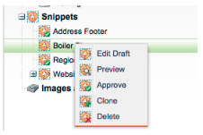

# Opmerkingen bij de release: maart 2012 {#release-notes-march}

## Mijn tokens oplossen {#resolve-my-tokens}

Mijn tokens (Program Tokens) worden verwerkt wanneer een voorbeeld van een e-mail wordt weergegeven, een teste-mail wordt verzonden en een lokale e-mail wordt verzonden via één flowactie. U hoeft niet langer een slimme campagne in het programma te maken om uw My Tokens te testen!

## Schakelen tussen de voorvertoningsfunctie en de Editor in e-mails en bestemmingspagina&#39;s {#toggle-between-previewer-and-editor-in-emails-and-landing-pages}

Met één muisklik kunt u gemakkelijk heen en weer gaan tussen de Editor en de voorvertoning.

Editor voor voorvertoning:

Voorvertoning aan Editor:

## Fragmentvoorvertoning {#snippet-previewer}

Als u &#39;&#39;Voorvertoning van fragment&#39;&#39; selecteert in het menu, kunt u een fragment weergeven zonder dat dit een concept is. Als u alleen-lezen toegang hebt tot een gedeeld fragment (via werkruimten), kunt u het fragment bovendien met deze handeling bekijken.

## Meerdere teste-mails verzenden {#send-multiple-test-emails}

Met de toevoeging van dynamische inhoud wordt het steeds belangrijker om alle variaties van de e-mails die naar uw leads kunnen worden verzonden, voor te vertonen en te testen. Als u een voorvertoning weergeeft met de functie Weergeven op regelafstand, kunt u een test voor de variaties verzenden vanuit de lijst met leads (maximaal 100 e-mails met tests).

## Dynamische bestemmingspagina&#39;s op basis van URL-parameter {#dynamic-landing-pages-based-on-url-parameter}

Anonieme leads maken een aanzienlijk deel van uw landingspagina&#39;s. Met de toevoeging van dynamische inhoud en de capaciteit om segmentatie in uw URL als parameter te zetten, kunt u uw het landen pagina inhoud dynamisch tonen wanneer een anonieme of bekende lood op de verbinding klikt.
