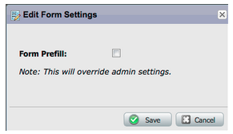

# Opmerkingen bij de release: mei 2012 {#release-notes-may}

## E-mailprestatierapport opnieuw ontwerpen {#email-performance-report-redesign}

Opmerking: dit wordt een gefaseerde uitrol, te beginnen met de release van mei

We hebben ervoor gezorgd dat de e-mailprestatierapporten voor e-mailprestaties en campagnes sneller werden uitgevoerd. We hebben ook de definities van bepaalde metriek verbeterd en de metriek &quot;Verzonden berichten&quot; en &quot;Verzonden leads&quot; geconsolideerd tot één metrische waarde, &quot;Verzonden&quot;. We hebben &quot;geleverde berichten&quot; en &quot;geleverde leads&quot; samengevoegd tot &quot;afgeleverd&quot;.

## Verbeteringen voor stap wachten {#wait-step-enhancements}

Gebruikend nieuwe Geavanceerd wacht eigenschappen, kunt u de wachttijdstap in een Slimme actie van de Stroom van de Campagne vormen &quot;wachten tot&quot;een specifieke dag van de week, de volgende bedrijfsdag, een specifieke datum of een tijd. Deze verbeteringen zorgen ervoor dat uw verplegend e-mails tijdens de kantooruren in de Postbus komen!

Figuur 1. Geef de gewenste wachtstap op voor een werkdag

## Gearchiveerde Assets Hidden {#archived-assets-hidden}

Gearchiveerde elementen worden automatisch gefilterd van automatische suggesties, vervolgkeuzelijsten en rapporten, zodat u gemakkelijker kunt terugvinden naar wat u zoekt!

Figuur 2. Voorbeeld van het gearchiveerde e-mailfilter

## New Event Check-in App for iPad {#new-event-check-in-app-for-ipad}

Vereenvoudig het inchecken van gebeurtenissen met onze nieuwe iPad-app! De app voor gebeurtenisinchecken synchroniseert met uw Marketo-programma en kunt u eenvoudig geregistreerde personen in een gebeurtenis controleren en nieuwe leads toevoegen.

Vereist iOS 5.1 of hoger; alleen iPad.

Figuur 3. Startpagina voor inchecken van gebeurtenissen

Figuur 4. Gebeurteniscontrole: selecteer uw gebeurtenis!

Figuur 5. Controleer ze in

## Verbeterde URL voor bevestiging van webinar {#enhanced-webinar-confirmation-url}

Nu beschikbaar voor [!DNL ON24] en Adobe Connect! Neem een unieke koppeling op in het bevestigingsbericht voor elke geregistreerde deelnemer die de nieuwe token `{{member.webinar URL}}` gebruikt. De Adobe Connect-verbeteringen omvatten ook de mogelijkheid om het e-mailbericht met accountgegevens van Adobe in of uit te schakelen dat de aanmeldings-id en het wachtwoord voor de gebruiker bevat.

Figuur 6. Mensen naar je webinar halen

## Sjabloonvoorbeeld {#template-preview}

Op zoek naar een specifieke sjabloon terwijl u uw e-mail- of landingspagina samenstelt, maar niet zeker hoe het eruit ziet? Met de nieuwe mogelijkheid voor sjabloonvoorvertoning kunt u de geselecteerde sjabloon controleren voordat u een nieuw element opslaat.

Figuur 7. Voorbeeld van de gekozen sjabloon bekijken

## Configureerbaar vooraf invullen van formulier {#configurable-form-prefill}

De pre-populatie van vormgegevens op het abonnementsniveau controleren en op het niveau van de landingspagina overschrijven. Zonder pre-populatie, kunt u ervoor zorgen de lood de meest bijgewerkte informatie verstrekt.

Figuur 8. Configuratie vooraf invullen van formulier in beheerder

Figuur 9. Instelling voor vooraf invullen van formulier bewerken op een bestemmingspagina

## Marketo Treasure Chest {#marketo-treasure-chest}

Verbeter toegang tot experimentele functies die door Marketo Engineers zijn ontwikkeld om uw gebruikerservaring te verbeteren. Deze release bevat E-mail Ongedaan maken, plus de mogelijkheid om opmerkingen in te voeren en met andere gebruikers samen te werken op uw bestemmingspagina&#39;s.

\

Figuur 10. Functies voor schatkist beheren in beheerder

## [!DNL Microsoft Dynamics]® CRM-integratie {#microsoft-dynamics-crm-integration}

Synchroniseer accounts, contactpersonen en leads tussen Marketo en [!DNL Microsoft Dynamics] CRM Online met onze nieuwe, vooraf gebouwde integratie!

Figuur 11. [!DNL Microsoft Dynamics] configuratie

## Verbeteringen voor Marketo [!DNL Sales Insight] {#marketo-sales-insight-enhancements}

**Unsubscribe de Opties van de Voettekst**

Configureer wanneer en als de voettekst voor opzeggen wordt weergegeven voor e-mails die via [!DNL Sales Insight] worden verzonden.

Figuur 12. [!DNL Sales Insight] Instellingen in Admin

## Mappen voor e-mailsjablonen voor verkoop {#folders-for-sales-email-templates}

U kunt de e-mailsjablonen die met Marketo [!DNL Sales Insight] worden gedeeld, nu in specifieke mappen ordenen, zodat uw verkopers het juiste e-mailadres gemakkelijker kunnen vinden.

Figuur 13. Kies een map voor uw e-mails

## Access Opportunity Analyzer vanuit [!DNL Sales Insight] {#access-opportunity-analyzer-from-sales-insight}

Verstrek uw Vertegenwoordigers van insight waarin de marketingactiviteiten de drijfveer van betrokkenheid vormen, gebruikend directe toegang tot de Analysator van de Kans van Marketo [!DNL Sales Insight]. Opmerking. Vereist een licentie voor de inkomstencyclusanalyse.

## Aangepast veld voor contactstatus {#custom-field-for-contact-status}

U kunt nu een aangepast veld in [!DNL Salesforce] toewijzen om het veld Status voor contactpersonen in Mijn beste testbestanden, Beste testpakketten van mijn team en aangepaste weergaven te vullen.

Figuur 14. Een aangepast veld toewijzen aan contactpersonen

Pagina&#39;s bezocht door anonieme leads

Boor tot de pagina&#39;s neer die door een anonieme lood van de [!UICONTROL Anonymous Web Activity] mening worden bekeken.

Figuur 15. Zie Anonieme webactiviteit

## Uitgebreide lead en contactpersoon {#enhanced-lead-and-contact-subscribe}

Volg een lead of neem op elk gewenst moment contact op met de nieuwe knop Abonneren op de pagina met recorddetails.
