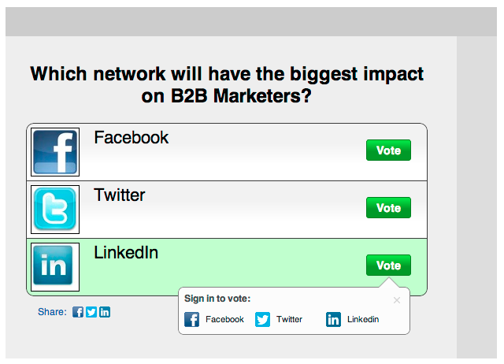

# Opmerkingen bij de release: oktober 2012 {#release-notes-october}

De release van oktober bevat spannende nieuwe functies. Sociale functies zijn beschikbaar als een invoegtoepassing of als onderdeel van geselecteerde bundels.

## Programma&#39;s importeren en Program Exchange {#import-programs-and-program-exchange}

Een programma kan worden geïmporteerd van het ene Marketo-abonnement naar het andere. U kunt bijvoorbeeld een programma maken in een sandbox en dit vervolgens importeren in uw live abonnement. Bovendien kunt u een vooraf gebouwd programma importeren uit de Marketo Program Library.

>[!NOTE]
>
>Alleen Marketo-gebruikers die toestemming hebben gekregen van een Marketo-beheerder kunnen programma&#39;s importeren.
>
>Neem contact op met Marketo Support om verbinding te maken met een sandboxaccount voor uw live abonnement.

## Meldingen {#notifications}

Meldingen houden je up-to-date over systeemgebeurtenissen die plaatsvinden in je Marketo-abonnement. Bijvoorbeeld, zal het systeem u automatisch op de hoogte brengen wanneer een campagne ontbreekt of uw synchronisatie van CRM aandacht nodig heeft. Meldingen zijn beschikbaar op het tabblad Mijn Marketo. Bovendien kunt u zich op een bericht abonneren zodat u hen in real time, in uw e-mail kunt ontvangen.

## Opiniepeiling {#polls}

Maak opiniepeilingen om uw leads te betrekken bij uw inhoud! Ze kunnen voor hun favoriete netwerk of film stemmen en de opiniepeiling delen met vrienden via hun sociale netwerken. U kunt rijke analyses verzamelen over waar uw leads voor hebben gestemd.

## Sociale activiteiten volgen {#track-social-activities}

Kom te weten wie uw inhoud en stem in uw opiniepeilingen deelt door slimme lijsten te creëren die op specifieke sociale activiteiten worden gebaseerd. Maak bijvoorbeeld een slimme campagne om de score te laten stijgen voor de leads die uw inhoud het meest delen!

## Sociale profielen {#social-profiles}

U kunt nu informatie over uw leads verzamelen wanneer ze inhoud delen of formulieren invullen met hun sociale profielen. Dit zijn onder andere [!DNL Facebook] -, [!DNL LinkedIn] - en [!DNL Twitter] -handgrepen, het aantal vrienden dat ze hebben en nog veel meer.

## [!UICONTROL Revenue Explorer] Abonnementen rapporteren {#revenue-explorer-report-subscriptions}

Maak rapportabonnementen en verzend [!UICONTROL Revenue Explorer] rapporten periodiek aan uw belangrijkste belanghebbenden, met inbegrip van gebruikers niet-Marketo. Het e-mailbericht bevat een voorvertoning van de tabel of grafieken met rapportgegevens en een [!DNL Excel] spreadsheet met alle rapportgegevens.

>[!NOTE]
>
>Alleen beschikbaar voor gebruikers die [!UICONTROL Revenue Explorer] hebben, door Revenue Cycle Analytics aan te schaffen met de Enterprise of de Select Edition.
