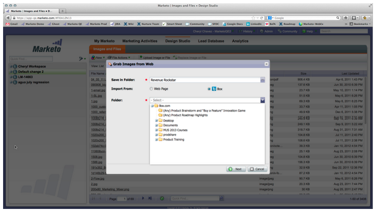

# Opmerkingen bij de release: april 2013 {#release-notes-april}

De volgende functies zijn opgenomen in de release van april.

## [!DNL Box] Integratie {#box-integration}

Sluit Marketo aan op uw [!DNL Box] -account om bestanden eenvoudig te kopiëren naar de ontwerpstudio.

## [!DNL Gmail] Insteekmodule {#gmail-plugin}

Als u zowel Marketo [!DNL Sales Insight] als [!DNL Gmail] gebruikt, kunt u de nieuwe [!DNL Gmail] plug-in installeren via de [!DNL Chrome] store. Met de insteekmodule kunt u berichten registreren bij Marketo, Marketo-e-mailsjablonen laden en berichten verzenden met de functies voor het bijhouden van Marketo.

## E-mailanalyse {#email-analysis}

Maak geavanceerde e-mailrapporten in [!UICONTROL Revenue Explorer], zoals het rapport Opwarmingsraster voor activiteit klikken. Dit rapport geeft insight informatie over de dag en tijd waarop mensen op links in je e-mails klikken.

De e-mailanalyse-functie als geheel wordt tijdens de maanden april en mei in fasen ingeschakeld bij het migreren van uw e-mailgegevens voor 2012 en 2013. Met andere woorden, sommige klanten hebben eerder toegang tot deze functie dan andere.

## Programma-API&#39;s {#program-apis}

Ondersteuning voor programma&#39;s in de SOAP API-aanroep, inclusief alleen-lezen toegang tot programmagegevens, zoals: tellingen voor programmalanden, verkregen door, succes, instellingen, kanalen, tags, tokens en kosten. Raadpleeg de SOAP API-documentatie voor meer informatie.

## [!DNL ON24] Verbetering {#on-enhancement}

Functie en bedrijfsnaam worden gesynchroniseerd met [!DNL ON24] vanuit het registratieformulier van Marketo.
