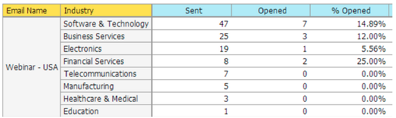

# Opmerkingen bij de release: december 2013 {#release-notes-december}

De volgende functies zijn opgenomen in de release van december.

Na de release moet u het tabblad Nieuwe release in de Gemeenschap bekijken voor gedetailleerde artikelen in de Knowledge Base voor elke functie.

## Email Program {#email-program}

Het verzenden van e-mailberichten is nooit eenvoudiger geweest. Gebruik het nieuwe [ e-mailprogramma ](/help/marketo/product-docs/email-marketing/email-programs/creating-an-email-program/understanding-email-programs.md) om een partije-mail, in plaats van het StandaardProgramma te verzenden. De slimme lijst definiëren, e-mailen, plannen en u bent uitgeschakeld!

Ook controleer het nieuwe [ E-mailMetriek Dashboard ](/help/marketo/product-docs/email-marketing/email-programs/email-program-data/view-the-email-program-dashboard.md) om te zien hoe uw e-mail presteerde.

## E-mail A/B testen {#email-a-b-testing}

In het nieuwe E-mailprogramma, stel een [ test A/B ](/help/marketo/product-docs/email-marketing/email-programs/email-program-actions/email-test-a-b-test/add-an-a-b-test.md) op een percentage van algemene e-mail in werking verzendt bevolking. U kunt kiezen uit vier verschillende typen tests: Onderwerpregel, Van adres, Datum/tijd en Gehele e-mail. U kunt er zelfs voor kiezen om de winnaar handmatig te promoten of het systeem de winnaar laten promoten op basis van vooraf gedefinieerde winnende criteria. Het nieuwe e-mailprogramma, inclusief een A/B-test, kan worden genest in Gebeurtenissen en het standaardprogramma om het verzenden van die e-mail zo eenvoudig te maken!

## E-mailkampioen/Challenger Testen {#email-champion-challenger-testing}

[ Champion/Challenger het testen ](/help/marketo/product-docs/email-marketing/general/functions-in-the-editor/email-tests-champion-challenger/add-an-email-champion-challenger.md) is gelijkaardig aan A/B test, maar het verschil is dat het voor teweeggebrachte e-mails wordt gebruikt en u verzendt niet automatisch een winnaar. Met deze test kun je een gevestigde manier uitdagen om iets te doen, de Champion, en je test of het nog steeds het beste is door een Challenger te introduceren. Bovendien kunnen Champion-/Challenger-e-mailtests worden gebruikt binnen streams van het betrokkenheidsprogramma.

## Details lead in [!UICONTROL Email Analysis] {#lead-details-in-email-analysis}

Er zijn extra lood- en bedrijfskenmerken toegevoegd aan [!UICONTROL Email Analysis] . U kunt nu uw e-mailstatussen weergeven die zijn gegroepeerd op nieuwe kenmerken, zoals [!UICONTROL Industry] en [!UICONTROL Lead Source] .

## Verbeterde [!DNL BrightTALK] gebeurtenisadapter {#enhanced-brighttalk-event-adapter}

Nu kunt u geregistreerde personen vanuit uw [!DNL BrightTALK] -kanaal en -gebeurtenis naar Marketo halen. U kunt deze informatie gebruiken om andere marketingcampagnes te informeren!
