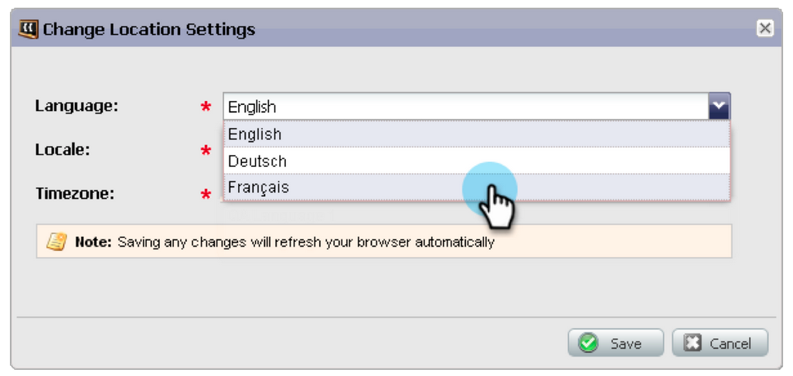

# Opmerkingen bij de release: januari 2013 {#release-notes-january}

De versie van Januari breidt ons sociaal aanbieden met **Verwijzingsaanbiedingen** uit. Bovendien kunnen gebruikers van [!DNL Marketo Lead Management] hun tijdzone, taal en landinstellingen instellen. Functies die zijn gemarkeerd met een &#42; , zijn alleen beschikbaar in de Select Edition.

## Verwijzingsvoorstellen {#referral-offers}

A **Verwijzing Aanbieding** geeft uw lood een prikkel om hun vrienden te verwijzen. Creëer doelstellingen en beloningen voor succesvolle verwijzingen. U kunt het gebruiken op landingspagina&#39;s, uw website, en zelfs Facebook.

## Tijdzonevoorkeur {#time-zone-preference}

U kunt de standaardtijdzone voor uw persoonlijke Marketo-account wijzigen. Zelfs als de standaardinstelling voor het abonnement Pacific Time is, kunt u deze voor uw eigen account wijzigen in Eastern Time.

## Selecteer uw [!DNL Marketo Lead Management] taal {#select-your-marketo-lead-management-language}

U kunt de standaardtaal voor uw Marketo-gebruikersaccount wijzigen. Zelfs als het standaardabonnement Engels is, kunt u het in het Duits of Frans voor eigen gebruik wijzigen.

## Meertalig formulierfoutberichten {#multi-lingual-form-error-messages}

Wanneer een lead een Marketo-formulier invult, worden sommige validatieberichten automatisch ingebouwd. U kunt voor deze foutberichten een andere weergavetaal kiezen. Wij steunen nu Engels, Duits, en Frans.

Een voorbeeld van een Frans formulier:

## Selecteer uw [!DNL Sales Insight] taal ([!DNL Salesforce] slechts) {#select-your-sales-insight-language-salesforce-only}

Als uw voorkeur voor de [!DNL Salesforce] -taal is ingesteld op Frans of Duits, zal Marketo [!DNL Sales Insight] zich aan deze voorkeur houden. Download het nieuwste MSI-pakket voor deze functionaliteit (beschikbaar in de week van 14 januari).

## Weergavenaam veld {#field-display-name}

In veldweergavenamen kan tekst in verschillende talen worden weergegeven (zo worden multibyte-tekens bijvoorbeeld ondersteund).

## Programmagegevens wijzigen {#change-program-data}

Met de stap [!UICONTROL Change Program Data] flow kunt u de [!UICONTROL Success] status en [!UICONTROL Success Date] van een programmalid handmatig wijzigen via een campagne. U kunt deze stroomstap gebruiken om een fout te corrigeren of om handmatig een lid te wijzigen dat mogelijk niet naar wens aan het programma heeft deelgenomen.

