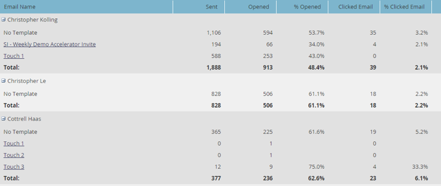
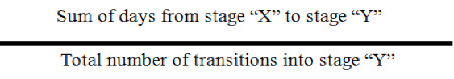
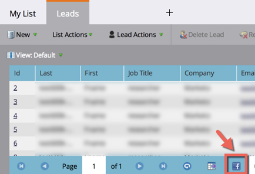

# Opmerkingen bij de release: december 2014 {#release-notes-december}

De volgende functies zijn opgenomen in de release van december 2014. Controleer of de Marketo Edition beschikbaar is. Na de release wilt u koppelingen naar gedetailleerde artikelen voor elke functie zoeken.

## Verkooprapporten {#sales-insight-reports}

Met het [Rapport E-mailprestaties van verkoopinzicht](/help/marketo/product-docs/marketo-sales-insight/msi-for-salesforce/features/performance-reports/sales-insight-email-performance-report.md) kunt u e-mailgegevens bekijken per e-mail en een vertegenwoordiger. Het steunt e-mails die door Salesforce, de Dynamica van Microsoft, de stop van Vooruitzichten en de stop van Gmail worden verzonden.

## Aangepast publiek voor facebook {#facebook-custom-audiences}

Als uw Marketo-beheerder [Facebook via Admin > Launchpoint](/help/marketo/product-docs/demand-generation/ad-network-integrations/add-facebook-custom-audiences-as-a-launchpoint-service.md) heeft toegevoegd, kunt u eenvoudig een aangepast publiek van Facebook maken, bijwerken of [vervangen door leads van een statische of slimme Marketo-lijst](/help/marketo/product-docs/demand-generation/facebook/create-a-custom-audience-in-facebook.md). Zoek het nieuwe Facebook-pictogram onder aan het hoofdraster van een statische of slimme lijst.

## Verbeterde klonen in alle werkruimten  {#improved-cloning-across-workspaces}

[Het klonen van een ](/help/marketo/product-docs/core-marketo-concepts/programs/working-with-programs/clone-a-program.md) programma naar een andere werkruimte is nooit eenvoudiger geweest! Wanneer u op Klonen klikt, selecteert u de doelwerkruimte. Klonen niet meer naar een map en verplaatsen vervolgens de map!

>[!NOTE]
>
>Deze nieuwe kloonfunctie is momenteel alleen beschikbaar voor programma&#39;s.

## Verwijzing slimme lijst {#reference-smart-list}

[Er kan worden ](/help/marketo/product-docs/core-marketo-concepts/smart-lists-and-static-lists/using-smart-lists/reference-a-list-or-smart-list-across-workspaces.md) verwezen naar slimme lijsten die worden gedeeld met een andere werkruimte bij het maken van een slimme lijst of flow.

## Verbeteringen voor importeren weergeven {#list-import-improvements}

[Import ](/help/marketo/getting-started/quick-wins/import-a-list-of-people.md) filesencoded in UTF-16, Shift-JIS, of EUC-JP. Wij blijven UTF-8-gecodeerde bestanden ondersteunen.

## Koppelingen bijhouden in e-mailscripts {#link-tracking-in-email-scripting}

Koppelingen in e-mailscripts worden nu bijgehouden en beschikbaar in het rapport Prestaties e-mailkoppeling.

## Instelling codering token {#token-encoding-setting}

We hebben een nieuwe beveiligingsfunctie voor het automatisch coderen van HTML-tokens ontwikkeld, die in maart 2015 standaard wordt ingeschakeld. Schakel deze functie in Veldbeheer tot die tijd in om het gedrag te testen. Alle lood- en bedrijfstokens worden gecodeerd wanneer deze in e-mails of landingspagina&#39;s worden ingevoegd. Er zijn ook opties beschikbaar voor afzonderlijke velden.

## Nieuwe aanroepen van ReST API {#new-rest-api-calls}

Drie nieuwe aanroepen voor de API voor leidende informatie en activiteiten:

・ Leverpartities ophalen

・ Associate Lead

・ Lead samenvoegen

Alle details zijn beschikbaar na de release op [developers.marketo.com](https://developers.marketo.com/)

## Verbeterde compatibiliteit met Munchkin JavaScript {#munchkin-javascript-compatibility-enhancements}

Er zijn enkele kleine verbeteringen aangebracht in Munchkin om ervoor te zorgen dat deze functie snel blijft laden en naar behoren functioneert in gevallen waarin andere JavaScript op de pagina wordt gebruikt.

De introductie wordt medio december gestart en de komende maanden voortgezet.

## Opbrengstverkenner - Geüpgraded look and Feel {#revenue-explorer-upgraded-look-and-feel}

## RTP: Module lijst met benoemde accounts {#rtp-named-account-list-module}

Beheer en controleer uw belangrijkste hoog-rendementsrekeningen op de nieuwe Benoemde pagina van Rekeningen. Upload nieuwe lijsten van genoemde rekeningen om deze organisaties te identificeren en te richten. We hebben het proces geautomatiseerd, zodat u meer controle en flexibiliteit hebt om uw marketingplannen op basis van account te implementeren en uw belangrijkste accounts op verschillende kanalen (web en reclame) kunt afstemmen.

## RTP: Schuivend effect voor campagnes in zones {#rtp-sliding-effect-for-in-zone-campaigns}

Er is een nieuw effect Schuivend toegevoegd voor InZone-campagnes, zodat uw persoonlijke inhoud tijdens het laden van de pagina op de juiste plaats kan worden geplaatst.

