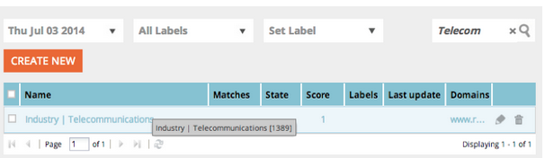

# Opmerkingen bij de release: juli 2014 {#release-notes-july}

De volgende functies zijn opgenomen in de release van juli 2014. Controleer of de Marketo Edition beschikbaar is. Kom terug na de release voor koppelingen naar gedetailleerde functiedocumentatie.

## Marketingkalender {#marketing-calendar}

Bekijk al uw gebeurtenissen, e-mails en meer in de verschillende programma&#39;s. [Dit nieuwe product](/help/marketo/product-docs/core-marketo-concepts/marketing-calendar/understanding-the-calendar/navigating-the-marketing-calendar.md) zijn gratis beschikbaar voor klanten met maximaal tien gebruikers van Marketo Lead Management of Dialog.

Documentatie over de marketingkalender is beschikbaar op het moment van de release.

## Nieuwe vormgeving en nieuwe vormgeving {#new-look-and-feel}

Marketo Lead Management wordt bijgewerkt met een nieuwe vormgeving die modern en stijlvol is en een bijgewerkte navigatie bevat.

## Datumoperatoren {#date-operators}

[Geavanceerde filters](/help/marketo/product-docs/core-marketo-concepts/smart-lists-and-static-lists/creating-a-smart-list/smart-list-filter-operators-glossary.md) voor &quot;in het verleden before&quot;, &quot;in future&quot; en &quot;in future after&quot;. Zoek bijvoorbeeld naar leads met een geboortedatum in de volgende drie maanden of een contract dat na zes maanden vervalt.

## Programmaplanningweergave {#program-schedule-view}

Naast de marketingkalender waarmee u uw gebeurtenissen en standaardprogramma&#39;s beheert, is er een nieuwe planningsweergave voor het programma.

* Alle datums in één keer opnieuw plannen
* Nieuwe negatieve datums - potlood het in!
* De types van Ingang van de douane - te doen, de Versie van de Pers, om het even wat u wilt

## Bewerkingen weergeven in de ReST-API {#list-operations-in-the-rest-api}

Hieronder staan de aanroepen die betrekking hebben op lijstbewerkingen in ReST. Zie [developers.marketo.com](https://developers.marketo.com/documentation/rest/) voor de volledige documentatie.

* Lijst ophalen op ID
* Meerdere lijsten ophalen
* Importeren in lijst
* Importstatus ophalen in lijst

## Snelle lijstimport {#fast-list-import}

Boven **50x sneller**, uw bestanden worden inzoomd op Marketo! De oude importopties &quot;Normaal&quot; en &quot;Geoptimaliseerd voor nieuwe leads&quot; zijn vervangen door &quot;Standaard (snel importeren)&quot;.

De optie Nieuwe leads en updates overslaan blijft ongewijzigd.

## Nieuwe verbeterde Munchkin! {#new-improved-munchkin}

De introductie zal medio juli worden gestart en de volgende maanden worden voortgezet.

* Verwijdert de afhankelijkheid van jQuery voor volledige en toekomstige compatibiliteit
* Meer compatibel met andere JavaScript op uw site
* Volledig getest op veel sites in het afgelopen jaar!

## RTP: Sjablonen voor realtime personalisatiecampagne {#rtp-real-time-personalization-campaign-templates}

De RTP Vastgestelde pagina van de Campagne nu [bevat kant-en-klare sjablonen](/help/marketo/product-docs/web-personalization/using-templates/using-templates-to-create-web-campaigns.md). U kunt kiezen uit verschillende stijlen, zoals webinars, casestudy&#39;s en e-books.

## RTP: Verbeteringen voor JavaScript API {#rtp-javascript-api-enhancements}

De nieuwe vraag van RTP API om bezoekersgegevens in real time zoals organisatie, industrie, plaats en segmentcodegelijke te krijgen. Als u de cursor boven een segmentnaam op de pagina Segmenten houdt, wordt bovendien knopinfo met de segmentcode weergegeven. Zie onze [ontwikkelaarssite](https://developers.marketo.com/documentation/websites/rtp-js-api/) voor volledige documentatie.

## RTP: HTML5-ondersteuning in de Inhoudseditor voor campagnes {#rtp-html-support-in-campaign-content-editor}

De inhoud WYSIWYG redacteur in de Vastgestelde pagina van Campagnes heeft nu volledige HTML5 verenigbaarheid. Klik op het pictogram &quot;HTML&quot;binnen de redacteur om het even welke HTML5 code op te nemen.
