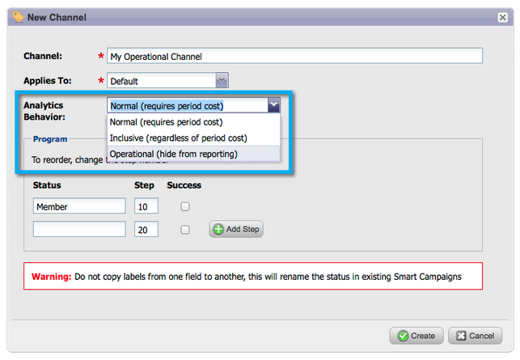

# Opmerkingen bij de release: maart 2014 {#release-notes-march}

De volgende functies zijn opgenomen in de release van maart 2014. Controleer of de Marketo Edition beschikbaar is. Na de versie, ben zeker om voor verbindingen aan kennisbasisartikelen voor elke eigenschap terug te komen.

## Knop Vernieuwen van dashboard voor e-mailprogramma {#email-program-dashboard-refresh-button}

Gebruik [ verfrissen knoop ](/help/marketo/product-docs/email-marketing/email-programs/email-program-data/use-the-email-program-dashboard.md) om tot de minieme e-mailmetriek over uw e-mail te krijgen verzendt of uw test van AB!

## Ongedaan maken/Opnieuw in de e-maileditor en de fragmenteditor {#undo-redo-in-the-email-editor-and-snippet-editor}

[ maak ongedaan of doe ](/help/marketo/product-docs/email-marketing/general/email-editor-2/edit-elements-in-an-email.md) tot 50 acties voor de huidige zitting opnieuw.

## De Kolommen van de Status van het programma in het Rapport van de Prestaties van het Programma {#program-status-columns-in-program-performance-report}

Wanneer het gebruiken van het [ rapport van de programmaprestaties ](/help/marketo/product-docs/core-marketo-concepts/programs/program-performance-report/add-program-status-columns-to-a-program-report.md), kunt u nu zien hoeveel mensen waarin programmastatussen zijn.

## Inclusieve en operationele programma&#39;s voor Analytics {#inclusive-and-operational-programs-for-analytics}

U kunt programma&#39;s zonder periodekosten ](/help/marketo/product-docs/reporting/revenue-cycle-analytics/program-analytics/make-a-program-without-a-period-cost-available-in-revenue-explorer-and-analyzers.md) in [!UICONTROL Revenue Explorer] en Analysatoren nu omvatten door de optie van het Gedrag van de Analyse aan &quot;Inclusief&quot;te plaatsen wanneer u de Kanalen van het Programma uitgeeft. [ U kunt ook operationele programma&#39;s uitsluiten van alle rapporten door &quot;Operationeel&quot; te kiezen.

## Hybride en impliciete opties voor lead-conversie {#hybrid-and-implicit-options-for-lead-conversion}

U kunt de manier veranderen Marketo contacten en kansen voor de metriek van de loodomzetting in Lead Analyse verbindt. U kunt [ de attributie veranderen plaatsend ](/help/marketo/product-docs/administration/settings/change-attribution-settings-for-analytics.md) in één van drie keuzen. Als u deze instelling wijzigt, worden Marketo- of CRM-gegevens niet gewijzigd. De manier waarop rapporten worden uitgevoerd, verandert en u kunt deze instelling op elk gewenst moment herstellen.

Expliciet het plaatsen zal contacten met rollen in een kans slechts behandelen zoals omgezette lood (standaardgedrag). Impliciet behandelt alle contacten verbonden aan de rekening in de kans, ongeacht rol, zoals omgezet. Hybrid behandelt contacten met rollen zoals omgezet indien beschikbaar; als niets, behandelen wij alle contacten in de rekening zoals omgezet.

Ter herinnering: deze instelling wijzigt ook de maatstaven voor de toewijzing van programma&#39;s.

## Aanvullende gebruikerstaal {#additional-user-language}

Selecteer Uw [ Taal van de Toepassing van Marketo ](/help/marketo/product-docs/administration/settings/select-your-language-locale-and-time-zone.md). Bekijk de Marketo Lead Management interface in uw voorkeurstaal — nu met ondersteuning voor Japans.

## Marketo Developer Blog {#marketo-developer-blog}

Het [ blog van de Ontwikkelaar van Marketo ](https://developers.marketo.com/blog/) wordt gewijd aan die Webontwikkelaars en softwareingenieurs die de snel evoluerende behoeften van de moderne marktspeler steunen. U kunt zich abonneren op aankondigingen over nieuwe integratieopties, API-versies-updates en een nieuwe reeks &#39;Hoe kan ik&#39;-artikelen die codevoorbeelden en aanbevolen procedures voor integratie met het Marketo-platform bevatten.

Het [ eerste artikel ](https://developers.marketo.com/blog/retrieving-customer-and-prospect-information-from-marketo-using-the-api/) in deze reeks zal u door lopen hoe te om informatie over de mensen (klanten/contacten/lood) efficiënt terug te winnen die binnen Marketo gebruikend API worden opgeslagen.
