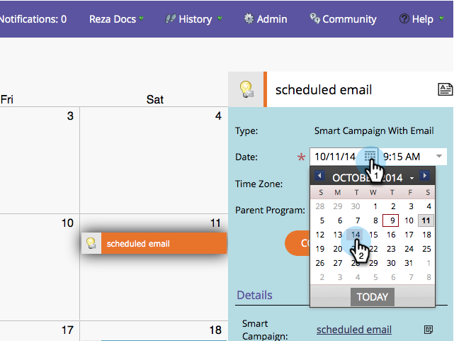

# Opmerkingen bij de release: oktober 2014 {#release-notes-october}

Raadpleeg de Marketo-editie voor informatie over de beschikbaarheid van functies. De documentatie zal op tijd van versie komen.

## Focus op programma in marketingkalender {#program-focus-in-marketing-calendar}

[ creeer en geef ingangen ](/help/marketo/product-docs/core-marketo-concepts/marketing-calendar/understanding-the-calendar/understand-enable-program-focus.md) direct van de marketing kalender uit.

## Nieuwe REST API-aanroepen {#new-rest-api-calls}

Gebruik de API om nieuwe activiteiten of wijzigingen aan leads aan te brengen:

* Wijzigingen in lead ophalen
* Leadactiviteiten ophalen
* Activiteitstypen ophalen
* Paginasken ophalen

De volledige details zullen na de versie in [ https://experienceleague.adobe.com/en/docs/marketo-developer/marketo/rest/rest-api ](https://experienceleague.adobe.com/en/docs/marketo-developer/marketo/rest/rest-api) beschikbaar zijn.

## MSI - Marketo-e-mail verzenden voor [!DNL Microsoft Dynamics] {#msi-send-marketo-email-for-microsoft-dynamics}

[ verzend en spoor verkoope-mails ](/help/marketo/product-docs/marketo-sales-insight/msi-for-microsoft-dynamics/setting-up-and-using/send-a-marketo-sales-email-from-microsoft-dynamics.md) aan lood en contacten van [!DNL Microsoft Dynamics].

## MSI - Toevoegen aan Marketo-campagnes voor [!DNL Microsoft Dynamics] {#msi-add-to-marketo-campaigns-for-microsoft-dynamics}

[ voegt lood en contacten aan de slimme campagnes van Marketo ](/help/marketo/product-docs/marketo-sales-insight/msi-for-microsoft-dynamics/setting-up-and-using/add-a-lead-contact-to-a-marketo-campaign-from-microsoft-dynamics.md) direct van binnen [!DNL Microsoft Dynamics] toe. Marketing kan kiezen welke Marketo-campagnes beschikbaar zijn voor verkoop.

## Ondersteuning voor aangepaste entiteit voor [!DNL Microsoft Dynamics] synchroniseren {#custom-entity-support-for-microsoft-dynamics-sync}

[ gegevens van het douaneobjecten van het Gebruik ](/help/marketo/product-docs/crm-sync/microsoft-dynamics-sync/microsoft-dynamics-sync-details/enable-sync-for-a-custom-entity.md) van [!DNL Microsoft Dynamics] voor het filtreren en het teweegbrengen in slimme lijsten, slimme campagnes, programma&#39;s..

## Shareholder-ondersteuning voor [!DNL Microsoft Dynamics] Sync {#shareholder-support-for-microsoft-dynamics-sync}

Synchroniseer de gegevens van de opportuniteitsaandeelhouder via [!DNL Dynamics]. Ook worden mogelijkheden ondersteund die zijn verbonden met een account via het veld &quot;Primaire account&quot; en de mogelijkheid om contact op te nemen via de synchronisatie &quot;Primaire contactpersoon&quot;.

## RTP - Verbeteringen dashboard {#rtp-dashboard-enhancements}

Het dashboard wordt nu uitgebreid en bevat nu meer gegevens in één oogopslag:

* Totaal aantal organisatiebezoeken
* De 5 meest presterende industrieën
* Totaal aantal geëngageerde bezoekers

## RTP - Nieuwe Mobiele Malplaatjes voor Campagnes {#rtp-new-mobile-templates-for-campaigns}

Snel en gemakkelijk [ creeer mobiele campagnes ](/help/marketo/product-docs/web-personalization/using-templates/using-templates-to-create-web-campaigns.md) met deze nieuwe malplaatjes.

## RTP - API voor gebruikerscontext {#rtp-user-context-api}

Gebruik een nieuwe vraag die de geschiedenis van het bezoek van de bezoeker volgt. Persoonlijke campagnes op basis van de website van de bezoeker:

* Eerder weergegeven pagina&#39;s
* Producten die geïnteresseerd zijn in
* Welke campagnes RTP hebben gezien

Bezoek [ https://experienceleague.adobe.com/en/docs/marketo-developer/marketo/javascriptapi/rich-media-recommendation ](https://experienceleague.adobe.com/en/docs/marketo-developer/marketo/javascriptapi/rich-media-recommendation) voor volledige details.
