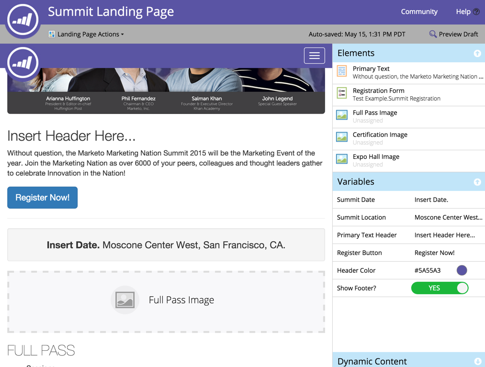

# Opmerkingen bij de release: mei 2015 {#release-notes-may}

De volgende functies zijn opgenomen in de release van mei 2015. Controleer of de Marketo Edition beschikbaar is. Na de release wilt u koppelingen naar gedetailleerde artikelen voor elke functie zoeken.

## Volledig responsieve landingspagina&#39;s

[Volledig responsieve landingspagina&#39;s](/help/marketo/product-docs/demand-generation/landing-pages/guided-landing-pages/create-a-guided-landing-page.md)

We geven een nieuwe bewerkingsmodus voor de bestemmingspagina en de sjabloonsyntaxis vrij. In tegenstelling tot onze bestemmingspagina-editor met de &quot;Vrije vorm&quot;, biedt de nieuwe bestemmingspagina-editor met de &quot;Met instructies&quot; een gestructureerde bewerkingservaring voor volledig reagerende bestemmingspagina&#39;s.

## E-mailprogramma afbreken

[E-mailprogramma afbreken](/help/marketo/product-docs/email-marketing/email-programs/email-program-actions/abort-email-program.md)

Hebt u op de knop Verzenden geklikt voordat een e-mailprogramma klaar was om uit te gaan? Trek de remmen met de nieuwe knop voor het afbreken van e-mailprogramma. Hiermee stopt u de e-mailprogramma&#39;s tijdens de vlucht direct in hun sporen.

## E-maillevering  {#email-deliverability}

Marketo voert nu wekelijkse geautomatiseerde [!DNL SPF] - en [!DNL DKIM] -controles uit op de toegevoegde domeinen. Houd hier bovenop door uw meldingen te controleren.

## Gedrag e-mailsjabloon wijzigen {#email-template-behavior-change}

Vanaf deze release zijn geldige HTML-opmerkingen nu toegestaan en niet verwijderd wanneer u nieuwe e-mailberichten maakt.

## RTP: de Redacteur van het Segment van de belemmering en van de Daling {#rtp-drag-and-drop-segment-editor}

RTP: [&#x200B; de Redacteur van het Segment van de Belemmering en van de Daling &#x200B;](/help/marketo/product-docs/web-personalization/using-web-segments/web-segments.md)

Sleep de criteria naar de gesegmenteerde builder, definieer de waarde en u bent op weg naar het maken van een real-time segment.

## RTP: Aanbevelingen voor voorspellende inhoud {#rtp-predictive-content-recommendations}

[Aanbevelingen voor voorspellende inhoud](/help/marketo/product-docs/predictive-content/enabling-predictive-content/enable-predictive-content-for-web-rich-media.md)

De machine van RTP van het gebruik het leren en voorspellende analysealgoritmen om de juiste inhoud aan het juiste vooruitzicht aan te bevelen. Verbeter uw inhoudselementen visueel met beelden en tekstbeschrijvingen en adviseer meer dan één inhoudsmiddel.
