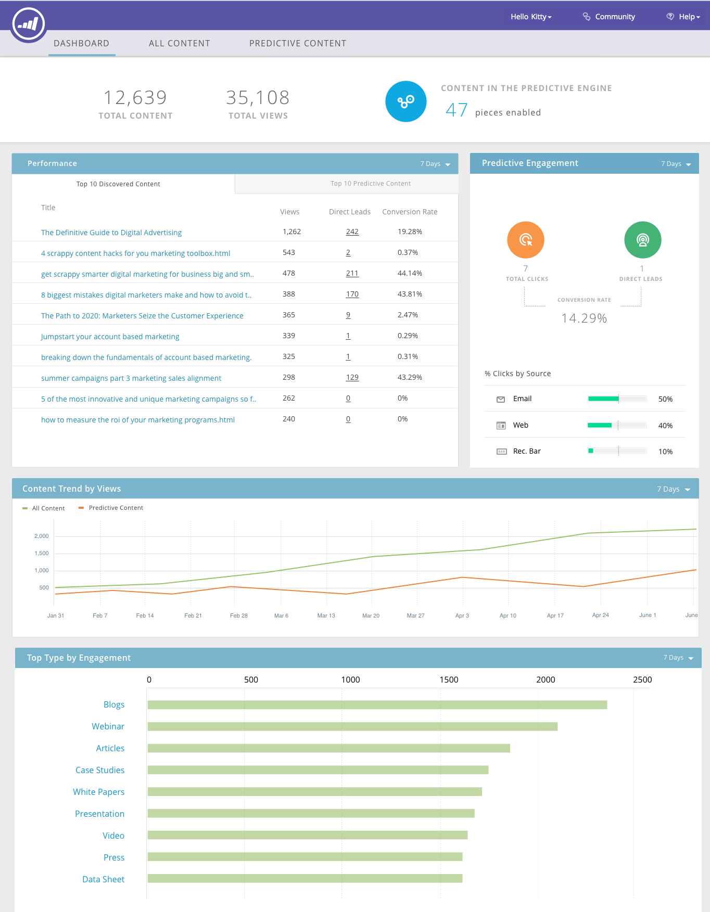

# Opmerkingen bij de release: val &#39;16 {#release-notes-fall}

De volgende functies zijn opgenomen in de Fall &#39;16-release. Raadpleeg de Marketo-editie voor informatie over de beschikbaarheid van functies. Klik op de titelkoppelingen om gedetailleerde artikelen voor elke functie weer te geven.

## [!UICONTROL Predictive Content] in e-mail {#predictive-content-in-email}

Onze [!UICONTROL Predictive Content] -toepassing heeft een nieuwe gebruikerservaring om uw inhoud te volgen, te beheren en aan te bevelen via het leren van machines en voorspellende algoritmen via het web en e-mailkanalen.

>[!NOTE]
>
>Alle klanten met de Predictive module zullen tegen 10 Januari worden toegelaten.

U kunt nu voorspellende inhoud aan uw e-mail toevoegen. Wanneer de e-mail wordt geopend, ontvangt de ontvanger automatisch relevante, aanbevolen inhoud die de betrokkenheid en conversies van inhoud helpt te verhogen.

## [ Facebook Offline Conversies ](/help/marketo/product-docs/demand-generation/facebook/understanding-facebook-offline-conversions.md) {#facebook-offline-conversions}

Met de integratie van [!DNL Facebook] Offline conversies worden conversiegegevens in Marketo (voor lead ad-leads) automatisch teruggestuurd naar [!DNL Facebook] , zodat uw advertentieteam de advertentieformaat beter kan optimaliseren. In dit [!DNL Facebook] Rapport Advertentiemanager worden de offlineconversies gemarkeerd.

## [ Universele identiteitskaart ](/help/marketo/product-docs/administration/settings/using-a-universal-id-for-subscription-login.md) {#universal-id}

Met een Universal ID hebt u toegang tot meerdere Marketo-abonnementen met één aanmelding en kunt u snel schakelen tussen abonnementen. U kunt één communautair profiel voor al uw abonnementen gebruiken.

>[!NOTE]
>
>Neem contact op met Marketo Support om deze functie in te schakelen.

## Op Marketo-account gebaseerde marketingverbeteringen {#marketo-account-based-marketing-enhancements}

Nu, kunt u rekeningsteams aan genoemde rekeningen in Account Based Marketing (ABM), bijvoorbeeld, rekeningseigenaar, verkoopontwikkelingsvertegenwoordiger, bedrijfsontwikkelingsvertegenwoordiger, en manager van het klantensucces toewijzen. U kunt ook accountspecifieke accountlijsten samenstellen en gepersonaliseerde wekelijkse ABM-rapporten naar het accountteam sturen.

**REST API**

Met deze release kunt u ook benoemde accountkenmerken en accountscores in ABM beheren met de Marketo REST API. Voor meer details over de API verrichtingen, gelieve de [ website van de Ontwikkelaars van Marketo ](https://developers.marketo.com/rest-api/lead-database/named-accounts) te bezoeken.

## [ Verbeteringen van het Spoor van de Controle ](/help/marketo/product-docs/administration/audit-trail/change-details-in-audit-trail.md) {#audit-trail-enhancements}

Het audittrail biedt een uitgebreide geschiedenis van de wijzigingen die zijn aangebracht in uw Marketo-abonnement. We hebben extra mogelijkheden voor het bijhouden van programma&#39;s toegevoegd en belangrijke wijzigingsdetails voor slimme campagnes, slimme lijsten en wijzigingen aan gebruikers en rollen nader toegelicht.

## Nieuwe machtigingen

**maak E-mail Operationeel**

Gone is de dagen dat u zich zorgen moest maken over het verzenden van transactie-e-mails naar mensen in uw database die zich niet meer hebben geabonneerd. U kunt nu opgeven welke gebruikers een e-mail kunnen laten werken of operationele e-mails kunnen bewerken.

**geeft de Beperkingen van de Campagne uit**

Waarom plaats [ campagnebeperkingen ](/help/marketo/product-docs/administration/email-setup/enable-person-restrictions-for-smart-campaigns.md) als u hen niet kunt afdwingen? Wanneer u de Montages van de Grens van de Campagne plaatst om het aantal mensen in uw gegevensbestand te beperken die met één enkele campagne kunnen worden gericht, hebt u nu de capaciteit om te beperken welke gebruikers deze montages kunnen met voeten treden wanneer het plannen van een campagne.

## [ Geluid voor Mobiele Push Meldingen ](/help/marketo/product-docs/mobile-marketing/push-notifications/configure-mobile-push-notification.md) {#sound-for-mobile-push-notifications}

Maak uw iOS Push Notification nog rijker door geluid in te schakelen. Met deze nieuwe functie kunt u een geluid activeren wanneer pushmelding wordt weergegeven op het mobiele apparaat.

>[!NOTE]
>
>* Apparaateigenaars kunnen ervoor kiezen te voorkomen dat geluiden worden afgespeeld in de apparaatinstellingen en toepassingsontwikkelaars kunnen eigenaaropties voor apparaten in de app opgeven om te voorkomen dat geluiden worden afgespeeld.
>* Geluiden worden automatisch afgespeeld wanneer een pushmelding wordt weergegeven op een Android-apparaat.

## [ Verkoop Insight Compatibel met de Encryptie van Salesforce ](/help/marketo/product-docs/marketo-sales-insight/msi-for-salesforce/installation/install-marketo-sales-insight-package-in-salesforce-appexchange.md) {#sales-insight-compatible-with-salesforce-encryption}

Market [!DNL Sales Insight] is nu compatibel met [!DNL Salesforce] Shield Encryption. Alle [!DNL Sales Insight] klanten zouden aan dit recentste beheerde pakket (versie 1.4359.2) moeten bevorderen, dat [ beschikbaar op  [!DNL Appexchange] ](https://appexchange.salesforce.com/listingDetail?listingId=a0N30000001SVZmEAO) is.

## [ Benoemde Rekeningen APIs ](https://developers.marketo.com/rest-api/lead-database/named-accounts/) {#named-accounts-apis}

Met deze release kunnen Marketo ABM-gebruikers benoemde accounts beheren via de API voor benoemde accounts. Gebruikers kunnen benoemde accounts maken, bijwerken en verwijderen, en ABM-accountscores lezen en bijwerken.

## [ E-mailredacteur v2.0 API Steun ](https://developers.marketo.com/rest-api/assets/emails/) {#email-editor-v-api-support}

U kunt variabelen en modules voor e-mailberichten in v2.0-indeling beheren met de Marketo REST API.

## [ Veranderingen in de Synchronisatie van Marketo Salesforce ](https://nation.marketo.com/docs/DOC-3840) {#changes-to-marketo-salesforce-sync}

De integratie met Marketo [!DNL Salesforce] ontwikkelt zich om de manier te verbeteren waarop Marketo-velden worden gesynchroniseerd met [!DNL Salesforce] . In plaats van een grote groep velden te moeten synchroniseren die u wellicht nodig hebt, kunt u nu kiezen welke velden u wilt opnemen. Bekijk hier onze documentatie voor meer informatie: [ https://nation.marketo.com/docs/DOC-3840 ](https://nation.marketo.com/docs/DOC-3840).
