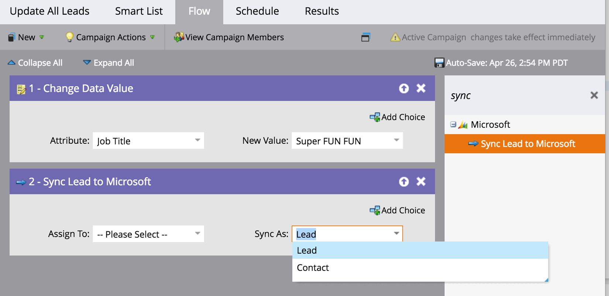

# Opmerkingen bij de release: lente 16 {#release-notes-spring}

De volgende functies zijn opgenomen in de release van lente 16. Klik op de titelkoppelingen om gedetailleerde artikelen voor elke functie weer te geven.

## [E-mailinzichten](/help/marketo/product-docs/reporting/email-insights/email-insights-overview.md) {#email-insights}

E-mailinzichten zijn een gloednieuwe historische ervaring met e-mailanalyse van geaggregeerde gegevens: geheel nieuw ontworpen voor bliksemsnelle prestaties. Het is voorzien van een volledig nieuw ontwerp voor de gebruikersinterface dat is geoptimaliseerd voor de behoeften en workflow van e-mailmarketers.

>[!NOTE]
>
>Wij lanceren e-mailinzichten aan klanten in partijen, die 3 juni beginnen. Ons doel is dit de komende maanden af te ronden. We sturen je een e-mail wanneer je bent ingeschakeld.

## [E-mailsjabloonkiezer](/help/marketo/product-docs/email-marketing/general/email-editor-2/email-template-picker-overview.md) {#email-template-picker}

Maak prachtige e-mails met onze nieuwe startsjablonen! Zoek uw sjablonen ook snel op via de live miniaturen.

>[!NOTE]
>
>De e-maileditor 2.0 (met de Sjabloonkiezer) wordt vanaf 3 juni geleidelijk ingevoerd. We zullen de uitrol voor 30 juni voltooien. In tegenstelling tot e-mailinzichten, wordt u niet op de hoogte gesteld wanneer u toegang hebt. Volg de stappen in [dit artikel](/help/marketo/product-docs/email-marketing/general/email-editor-2/transitioning-to-email-editor-2-0.md).

## [E-mailbewerking—Opnieuw voorgesteld](/help/marketo/product-docs/email-marketing/general/email-editor-2/email-editor-v2-0-overview.md) {#email-editing-re-imagined}

Dat klopt, een gloednieuwe e-maileditor! Gebruik de lichtgewichtfunctionaliteit voor slepen en neerzetten om inhoud toe te voegen en opnieuw te ordenen. De nieuwe elementen, met inbegrip van beelden, video&#39;s, variabelen, en modules, zijn zeker om uw het uitgeven ervaring te verbeteren. Bekijk ook de bijgewerkte code-editor, voorvertoning en ondersteuning voor voorvertoningen.

## [Mobiele berichten in de app](/help/marketo/product-docs/mobile-marketing/in-app-messages/understanding-in-app-messages.md) {#mobile-in-app-messages}

Maak verbluffende berichten in de app voor uw app in Marketo. Definieer precies wie het moet zien en wanneer het bericht in de app wordt weergegeven. U kunt de prestaties van het programma eenvoudig controleren met het dashboard.

## [Geen conceptsfragmenten](/help/marketo/product-docs/administration/users-and-roles/enable-no-draft-for-snippets.md) {#no-draft-snippets}

Gone is de dagen waarin u alles opnieuw moet goedkeuren telkens als een fragment wordt bijgewerkt! Met Geen concept krijgen alle e-mails en bestemmingspagina&#39;s die een fragment gebruiken, de updates van het fragment en de status van het voorgaande fragment. Elke keer dat u een fragment goedkeurt, hebt u de keuze om Geen concept uit te voeren en alles bij te werken, of concepten te maken. Het is aan jou! Geen concept is beschikbaar voor alle klanten en wordt gecontroleerd door een nieuwe machtiging in Admin.

## [Openingspagina, sjabloon voor bestemmingspagina en formulier-API&#39;s](https://developers.marketo.com/blog/spring-2016-updates/) {#landing-page-landing-page-template-and-form-apis}

De Marketo REST API&#39;s bieden nu ondersteuning voor het beheer van Marketo-bestemmingspagina&#39;s, landingspaginasjablonen en -formulieren. Gebruikers kunnen deze middelen nu rechtstreeks via de Marketo REST API maken, bijwerken, goedkeuren en verwijderen.

## [IP Voegende op lijst van gewenste personen  voor API Toegang](/help/marketo/product-docs/administration/additional-integrations/create-an-allowlist-for-ip-based-api-access.md) {#ip-allowlisting-for-api-access}

Vergelijkbaar met de IP voegende op lijst van gewenste personen eigenschap voor de gebruikerslogins van Marketo, kunnen de beheerders van Marketo een lijst van gewenste personen van IP adressen nu opstelling die tot de de ZEEP en HEEFT APIs van Marketo kunnen toegang hebben, daardoor blokkerend toegang van niet-gemachtigde IP adressen. Dit biedt een extra beveiligingslaag voor uw Marketo-instantie en zorgt ervoor dat API-toegang alleen kan plaatsvinden vanuit het netwerk van uw organisatie. Meer informatie over het instellen van deze instelling vindt u op het tabblad [Marketo-documentatiesite](/help/marketo/product-docs/administration/additional-integrations/create-an-allowlist-for-ip-based-api-access.md).

## [Nieuwe snelle Microsoft Dynamics Sync Connector](/help/marketo/product-docs/crm-sync/microsoft-dynamics-sync/microsoft-dynamics-sync-details/sync-status.md) {#new-high-speed-microsoft-dynamics-sync-connector}

De nieuwe high-speed Dynamic-connector biedt snelheden tot 20 keer sneller voor eerste synchronisatie en tot 5 keer sneller voor incrementele synchronisatie. Alle nieuwe klanten zullen aan deze schakelaar op de versiedatum, en wij zullen het geleidelijk aan aan bestaande klanten over het tijdkader van de zomerversie uitrollen.

**Gegevens vernieuwen voor nieuwe velden**: Nu kunt u nieuwe synchronisatievelden op elk moment inschakelen en alle gegevenswaarden voor dat veld worden vernieuwd van Dynamics CRM in Marketo. U hoeft niet meer alle velden te selecteren tijdens de eerste installatie. Als u een bestaand synchronisatieveld onbruikbaar maakt en het later opnieuw toelaat, zullen alle gegevenswaarden voor dat gebied van Dynamica CRM in Marketo worden vernieuwd.

**Lead synchroniseren als contactpersoon**: De stroomactie &#39;Lead synchroniseren naar Microsoft&#39; heeft een nieuwe optie voor synchronisatie als lead of contactpersoon.

**Tabblad Fouten beheren synchroniseren**: Bladeren, zoeken of exporteren leidt tot gegevensverlies (en andere objecten) die niet kan worden gesynchroniseerd met details zoals bewerking, richting, foutcode en foutbericht.

**Microsoft Dynamics 2016**: De connector is volledig gecertificeerd voor Dynamics 2016 Online en On-premise versies.

**Updates van plug-ins worden nu gedocumenteerd:** Zie de [plug-in werkt docs-artikel bij](/help/marketo/product-docs/crm-sync/microsoft-dynamics-sync/marketo-plugin-releases-for-microsoft-dynamics.md).

## [Naam van vriendelijke instantie](/help/marketo/product-docs/administration/settings/edit-subscription-settings.md) {#friendly-instance-name}

Vandaag, is het moeilijk om tussen de instanties van Marketo, bijvoorbeeld, zandbak en productie instanties te onderscheiden. Met deze functie weet u aan welke instanties u momenteel werkt.

## [Beperkte toegang voor abonnementen](/help/marketo/product-docs/administration/users-and-roles/managing-marketo-users.md) {#limited-time-access-for-subscriptions}

Gebruikers worden vandaag uitgenodigd voor een abonnement op Marketo voor onbepaalde tijd. Met deze functie kunnen beheerders gebruikers uitnodigen voor abonnementen voor een beperkte periode, bijvoorbeeld 2 weken of 1 maand.

## [Aangepast objectraster](/help/marketo/product-docs/administration/marketo-custom-objects/understanding-marketo-custom-objects.md) {#custom-objects-grid}

U kunt nu het aantal records en velden voor alle gepubliceerde aangepaste objecten weergeven.

## Aangepaste activiteiten {#custom-activities}

Marketo-beheerders kunnen hun aangepaste activiteitstypen nu definiëren en beheren via het Marketo Custom Activity Definition-model. Beheerders kunnen het gegevensmodel net als (en in combinatie met) de Marketo Custom Object Modeler nu uitbreiden om precies aan hun zakelijke behoeften te voldoen. Nadere gegevens over het gebruik van deze functie zijn beschikbaar op het tabblad [Marketo-documentatiesite](/help/marketo/product-docs/administration/marketo-custom-activities/understanding-custom-activities.md).
