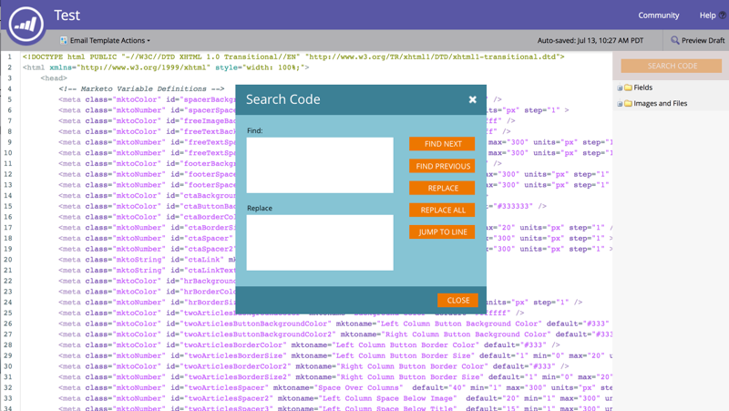

# Opmerkingen bij de release: zomer 16 {#release-notes-summer}

De volgende functies zijn opgenomen in de release van zomer 16. Raadpleeg de Marketo-editie voor informatie over de beschikbaarheid van functies. Klik op de titelkoppelingen om gedetailleerde artikelen voor elke functie weer te geven.

## [Op account gebaseerde marketing](https://docs.marketo.com/display/docs/account+based+marketing) {#account-based-marketing}

Op Marketo-account gebaseerde marketing biedt alle basisprincipes in één uniform platform:

* **Doel** - Accountdetectie, &#39;lead-to-account&#39;-overeenkomst en accountlijsten met namen
* **Inschakelen** - Op account gebaseerde personalisatie, betrokkenheid tussen verschillende kanalen en accountspecifieke workflows
* **Meetlat** - Inzichten op account- en lijstniveau, accountbetrokkenheidsscore en impact op pijpleidingen en inkomsten

>[!NOTE]
>
>ABM is beschikbaar als een invoegtoepassing voor uw Marketo-abonnement. Neem daarom contact op met uw verkoper om het te laten implementeren.

## [Audittrail](/help/marketo/product-docs/administration/audit-trail/audit-trail-overview.md) {#audit-trail}

Het audittrail biedt een uitgebreide geschiedenis van de wijzigingen die zijn aangebracht in uw Marketo-abonnement. Het zal verantwoordingsplicht onder gebruikers en beheerders tot stand brengen, hulp de oorzaak van onverwacht gedrag identificeren, en de veiligheid van het weten verstrekken wie doet wat en wanneer. Deze informatie zal op elk ogenblik beschikbaar zijn en kan worden gebruikt om vragen zoals te beantwoorden:

* Wat is er gebeurd met dit middel of deze instelling en wie heeft deze voor het laatst bijgewerkt?
* Wat heeft gebruiker X bereikt?
* Wie logt zich aan bij ons account?

## [Marketo-Vibes SMS LaunchPoint Integration](/help/marketo/product-docs/mobile-marketing/vibes-sms-messages/create-an-sms-message.md) {#marketo-vibes-sms-launchpoint-integration}

Maak eenvoudig SMS-berichten in Marketo. Pas uw bericht aan met uw rijke Marketo-gegevens en controleer de prestaties eenvoudig met het SMS-berichtendashboard.

>[!NOTE]
>
>Voor deze functie is een bestaande SMS-account van Vibes vereist.

## [Verbeteringen voor e-mail 2.0](/help/marketo/product-docs/email-marketing/general/email-editor-2/email-editor-v2-0-overview.md) {#email-enhancements}

**Variabelen op moduleniveau**

Eerder waren alle variabelen die in de sjablonen voor e-mail 2.0 werden opgegeven &quot;globaal&quot; in het bereik. Wanneer het gebruiken van variabelen binnen modules, is dit niet altijd wenselijk als u van plan bent om veelvoudige instanties van de module te gebruiken. Met deze versie, kunnen de variabelen nu als &quot;moduleniveau worden gespecificeerd,&quot;dat u toestaat om erop te wijzen dat de gebruiker unieke waarden voor elke module zou moeten kunnen plaatsen zij binnen worden gebruikt.

**Syntaxisupdates**

* U kunt &quot;mktoAddByDefault&quot;nu op modules gebruiken die in E-mail 2.0 Malplaatjes worden gespecificeerd om erop te wijzen welke modules in nieuwe e-mails door gebrek zouden moeten worden getoond. Dit is veel handiger als u een e-mailsjabloon met grote aantallen modules maakt.
* Bij afbeeldingselementen kunt u nu opgeven of de onderliggende elementen `` De eigenschappen &#39;height&#39; en &#39;width&#39; van het HTML-element moeten vergrendeld of bewerkbaar zijn voor de eindgebruiker. mktoLockImgSize=&quot;true&quot; zorgt ervoor dat de hoogte/breedte wordt vergrendeld (zelfs als de afbeelding wordt gewijzigd). Op dezelfde manier zorgt mktoLockImgStyle=&quot;true&quot; dat de eigenschap &quot;style&quot; wordt vergrendeld.

**Zoeken in code**

Gebruik de nieuwe zoekfunctionaliteit om op efficiënte wijze inhoud in de code van uw e-mail te zoeken en te vervangen. Deze functionaliteit is ook beschikbaar in de E-mailsjablooneditor.

**Tokenondersteuning in afbeeldingselementen**

Tokens kunnen nu worden gebruikt in het gebied Externe URL van de ervaring bij het invoegen van afbeeldingen! Als u afbeeldingen hebt opgegeven met `{{my.tokens}}`kunt u nu naar deze tokens verwijzen in de e-maileditor 2.0. De afbeelding wordt nog steeds verbroken weergegeven in het canvas van de e-maileditor 2.0. U ziet ze echter wel weergegeven in Voorbeeld en Voorbeeld verzenden voordat u uw e-mail verzendt.

## Meerdere merkdomeinen {#multiple-branding-domains}

Gone is de dagen waarin koppelingen voor het bijhouden van e-mails alleen met één merkdomein kunnen worden gemarkeerd. U kunt nu meerdere brandingdomeinen toevoegen om het vertrouwen van de consument te vergroten, een gestroomlijnder uiterlijk te creëren om de aandacht op merken te richten, de e-mailleverbaarheid te verbeteren en per e-mail te kiezen welk brandingdomein moet worden gebruikt voor de trackingkoppelingen van elke e-mail.

## [Programmatokens](/help/marketo/product-docs/demand-generation/landing-pages/personalizing-landing-pages/tokens-overview.md) {#program-tokens}

We hebben een nieuw tokentype voor programma&#39;s gemaakt. U kunt de Naam, de Beschrijving, en identiteitskaart van het Programma in activa en slimme stappen van de campagnestroom nu teruggeven.

## [Enterprise Key](/help/marketo/product-docs/marketo-sales-insight/msi-outlook-plugin/authorize-the-marketo-outlook-plugin.md) {#enterprise-key}

Het kan vervelend zijn elke persoon op uw verkoopteam te vereisen om onze Inzicht van de Verkoop voor Vooruitzichten te installeren. We hebben een nieuwe manier geïntroduceerd om de insteekmodule voor Outlook extern te installeren met behulp van een bedrijfssleutel. Stuur uw IT-team de unieke sleutel die u vindt in de sectie Marketo Sales Insight van Admin en laat ze de rest uitvoeren.

## [Aanpassingscampagnes op het web](/help/marketo/product-docs/web-personalization/working-with-web-campaigns/create-a-new-dialog-web-campaign.md) {#web-personalization-campaigns}

Geef een vertraging op voor webcampagnes die moeten reageren op uw website.

## [Inhoud analyseren en Recommendations exporteren](/help/marketo/product-docs/web-personalization/understanding-web-personalization/understanding-content-analytics.md) {#content-analytics-and-recommendations-export}

Analyses en aanbevelingen voor inhoud offline weergeven.

## [API-ondersteuning voor e-maileditor 2.0](https://developers.marketo.com/documentation/asset-api/) {#api-support-for-email-editor}

Bestaande API&#39;s voor middelen, die voorheen alleen compatibel waren met e-mailberichten en sjablonen van versie 1.0, zijn nu ingeschakeld voor e-mailmiddelen van versie 2.0.

## [Marketo Developers Site](https://developers.marketo.com/) {#marketo-developers-site}

Nieuw en verbeterd!

## [Privacy-instellingen](/help/marketo/product-docs/administration/settings/understanding-privacy-settings.md) {#privacy-settings}

Marketers kunnen privacy-instellingen gebruiken om te beslissen of ze bezoekers willen volgen met Munchkin en Web Personalization-functies. Het niveau van het volgen wordt gecontroleerd door browser te gebruiken niet het volgen plaatsen, een opt-out koekje, of een niet-specifieke IP. Deze methoden kunnen van invloed zijn op de waarde en functionaliteit van Marketo in bepaalde gebieden, maar als de markering niets verandert, blijft de Marketo-functionaliteit ongewijzigd.

Dit onderdeel wordt geleidelijk aan over een periode van zes weken aan klanten vrijgegeven. Neem contact op met Marketo Support als je dit meteen nodig hebt.
