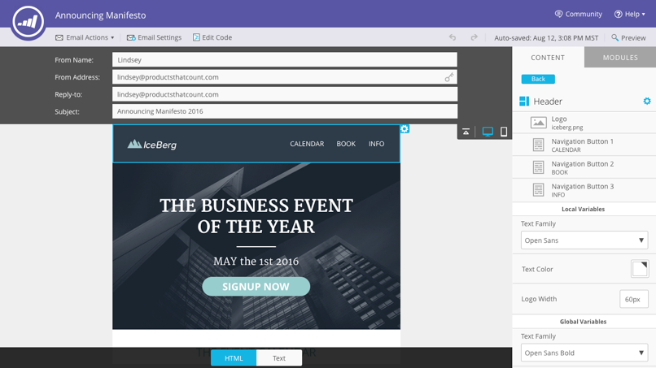
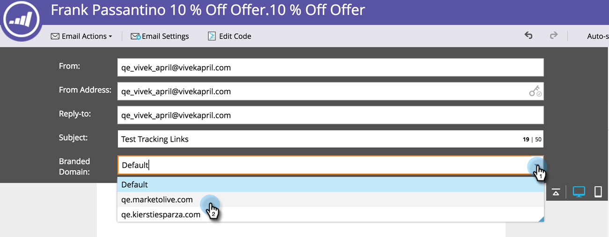

# Opmerkingen bij de release: zomer 16 {#release-notes-summer}

De volgende functies zijn opgenomen in de release van zomer 16. Raadpleeg de Marketo-editie voor informatie over de beschikbaarheid van functies. Klik op de titelkoppelingen om gedetailleerde artikelen voor elke functie weer te geven.

## [ Op rekening gebaseerde Marketing ](https://docs.marketo.com/display/docs/account+based+marketing) {#account-based-marketing}

Op Marketo-account gebaseerde marketing biedt alle basisprincipes in één uniform platform:

* **Doel** - de Ontdekking van de Rekening, Lood-aan-Rekening het Aanpassen, en de Genoemde Lijsten van de Rekening
* **0&rbrace; Betrokkenheid {bij 1} - Op rekening-gebaseerde Personalization, dwars-kanaalovereenkomst, en rekening-specifieke Workflows**
* **Maatregel** - de Inzichten van de Rekening en van het lijstniveau, de Score van de Betrokkenheid van de Rekening, en de Gevolgen van de Pijpleiding &amp; van de Inkomsten

>[!NOTE]
>
>ABM is beschikbaar als een invoegtoepassing voor uw Marketo-abonnement. Neem daarom contact op met uw verkoper om het te laten implementeren.

## [ Spoor van de Controle ](/help/marketo/product-docs/administration/audit-trail/audit-trail-overview.md) {#audit-trail}

Het audittrail biedt een uitgebreide geschiedenis van de wijzigingen die zijn aangebracht in uw Marketo-abonnement. Het zal verantwoordingsplicht onder gebruikers en beheerders tot stand brengen, hulp de oorzaak van onverwacht gedrag identificeren, en de veiligheid van het weten verstrekken wie doet wat en wanneer. Deze informatie zal op elk ogenblik beschikbaar zijn en kan worden gebruikt om vragen zoals te beantwoorden:

* Wat is er gebeurd met dit middel of deze instelling en wie heeft deze voor het laatst bijgewerkt?
* Wat heeft gebruiker X bereikt?
* Wie logt zich aan bij ons account?

## Marketo-Vibes SMS LaunchPoint Integration

Maak eenvoudig SMS-berichten in Marketo. Pas uw bericht aan met uw rijke Marketo-gegevens en controleer de prestaties eenvoudig met het SMS-berichtendashboard.

>[!NOTE]
>
>Voor deze functie is een bestaande [!DNL Vibes SMS] -account vereist.

## [ E-mail 2.0 Verbeteringen ](/help/marketo/product-docs/email-marketing/general/email-editor-2/email-editor-v2-0-overview.md) {#email-enhancements}

**module-vlakke Variabelen**

Eerder waren alle variabelen die in de sjablonen voor e-mail 2.0 werden opgegeven &quot;globaal&quot; in het bereik. Wanneer het gebruiken van variabelen binnen modules, is dit niet altijd wenselijk als u van plan bent om veelvoudige instanties van de module te gebruiken. Met deze versie, kunnen de variabelen nu als &quot;moduleniveau worden gespecificeerd,&quot;dat u toestaat om erop te wijzen dat de gebruiker unieke waarden voor elke module zou moeten kunnen plaatsen zij binnen worden gebruikt.

**Updates van de Syntaxis**

* U kunt &quot;mktoAddByDefault&quot;nu op modules gebruiken die in E-mail 2.0 Malplaatjes worden gespecificeerd om erop te wijzen welke modules in nieuwe e-mails door gebrek zouden moeten worden getoond. Dit is veel handiger als u een e-mailsjabloon met grote aantallen modules maakt.
* Op afbeeldingselementen kunt u nu opgeven of de eigenschappen &#39;height&#39; en &#39;width&#39; van het onderliggende `` HTML-element moeten zijn vergrendeld of kunnen worden bewerkt voor de eindgebruiker. mktoLockImgSize=&quot;true&quot; zorgt ervoor dat de hoogte/breedte wordt vergrendeld (zelfs als de afbeelding wordt gewijzigd). Op dezelfde manier zorgt mktoLockImgStyle=&quot;true&quot; dat de eigenschap &quot;style&quot; wordt vergrendeld.

**het Onderzoek van de Code**

Gebruik de nieuwe zoekfunctie om op efficiënte wijze inhoud in de e-mailcode te zoeken en te vervangen. Deze functionaliteit is ook beschikbaar in de E-mailsjablooneditor.

**Symbolische Steun in Elementen van het Beeld**

Tokens kunnen nu worden gebruikt in het gebied Externe URL van de ervaring bij het invoegen van afbeeldingen! Als u afbeeldingen hebt opgegeven met `{{my.tokens}}` , kunt u nu naar deze tokens verwijzen in de e-maileditor 2.0. De afbeelding wordt nog steeds verbroken weergegeven in het canvas van de e-maileditor 2.0. U ziet ze echter wel weergegeven in Voorbeeld en Voorbeeld verzenden voordat u uw e-mail verzendt.

## Meerdere merkdomeinen {#multiple-branding-domains}

Gone is de dagen waarin koppelingen voor het bijhouden van e-mails alleen met één merkdomein kunnen worden gemarkeerd. U kunt nu meerdere brandingdomeinen toevoegen om het vertrouwen van de consument te vergroten, een gestroomlijnder uiterlijk te creëren om de aandacht op merken te richten, de e-mailleverbaarheid te verbeteren en per e-mail te kiezen welk brandingdomein moet worden gebruikt voor de trackingkoppelingen van elke e-mail.

## [ Tokens van het Programma ](/help/marketo/product-docs/demand-generation/landing-pages/personalizing-landing-pages/tokens-overview.md) {#program-tokens}

We hebben een nieuw tokentype voor programma&#39;s gemaakt. U kunt de Naam, de Beschrijving, en identiteitskaart van het Programma in activa en slimme stappen van de campagnestroom nu teruggeven.

## [ Sleutel van de Onderneming ](/help/marketo/product-docs/marketo-sales-insight/msi-outlook-plugin/authorize-the-marketo-outlook-plugin.md) {#enterprise-key}

Het kan lastig zijn om van elke persoon in uw verkoopteam de [!DNL Sales Insight] insteekmodule voor [!DNL Outlook] te installeren. We hebben een nieuwe manier geïntroduceerd om de insteekmodule voor [!DNL Outlook] extern te installeren met behulp van een bedrijfssleutel. Verzend uw IT-team naar de unieke sleutel in de Marketo [!DNL Sales Insight] -sectie van [!UICONTROL Admin] en laat ze de rest uitvoeren.

## [ Campagnes van Personalization van het Web ](/help/marketo/product-docs/web-personalization/working-with-web-campaigns/create-a-new-dialog-web-campaign.md) {#web-personalization-campaigns}

Geef een vertraging op voor webcampagnes die moeten reageren op uw website.

## [ de Uitvoer van Content Analytics en van Aanbevelingen ](/help/marketo/product-docs/web-personalization/understanding-web-personalization/understanding-content-analytics.md) {#content-analytics-and-recommendations-export}

Analyses en aanbevelingen voor inhoud offline weergeven.

## [ API Steun voor E-mailRedacteur 2.0 ](https://developers.marketo.com/documentation/asset-api/) {#api-support-for-email-editor}

Bestaande API&#39;s voor middelen, die voorheen alleen compatibel waren met e-mailberichten en sjablonen van versie 1.0, zijn nu ingeschakeld voor e-mailmiddelen van versie 2.0.

## [ de Plaats van de Ontwikkelaars van Marketo ](https://developers.marketo.com/) {#marketo-developers-site}

Nieuw en verbeterd!

## [ Montages van de Privacy ](/help/marketo/product-docs/administration/settings/understanding-privacy-settings.md) {#privacy-settings}

Marketers kunnen privacy-instellingen gebruiken om te beslissen of ze bezoekers willen volgen met behulp van [!DNL Munchkin] - en Web Personalization-functies. Het niveau van het volgen wordt gecontroleerd door browser te gebruiken niet het volgen plaatsen, een opt-out koekje, of een niet-specifieke IP. Deze methoden kunnen van invloed zijn op de Marketo-waarde en -functionaliteit in specifieke gebieden, maar als de markeerteken niets verandert, blijft de Marketo-functionaliteit ongewijzigd.

Dit onderdeel wordt geleidelijk aan over een periode van zes weken aan klanten vrijgegeven. Neem contact op met Marketo Support als je dit meteen nodig hebt.
