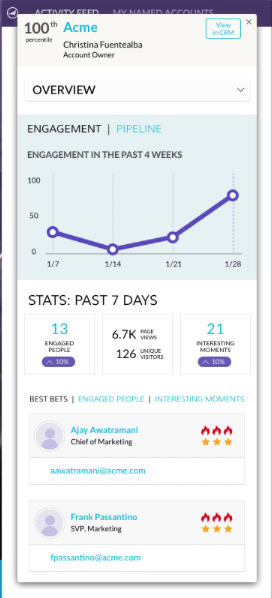

# Opmerkingen bij de release: verbeteringen in ABM in augustus &#39;17 {#release-notes-august-abm-enhancements}

De volgende functies zijn opgenomen in de ABM-verbeteringsrelease van augustus 17. Raadpleeg de Marketo-editie voor informatie over de beschikbaarheid van functies.

Klik op de titelkoppelingen om gedetailleerde artikelen voor elke functie weer te geven.

## [!DNL Account Insight] {#account-insight}

**[[!DNL Account Insight]](/help/marketo/product-docs/target-account-management/setup-tam/account-insight-plug-in-overview.md)** is een [!DNL Google Chrome] -plug-in waarmee u actionable ABM en accountinzichten voor uw verkoopteams kunt bekijken, zodat ze nauw met marketing kunnen samenwerken om effectief accounts in dienst te nemen. Verkoopteams krijgen inzicht in de gegevens en inzichten die worden gegenereerd voor elk van de benoemde accounts die ze bezitten. Dit omvat de percentielen van de rekeningsscore, een prioriteitenlijst van hun Benoemde Rekeningen, betreden mensen binnen die rekeningen, en een levende activiteitenstroom van recente activiteiten van de rekening.

 

## [&#x200B; Dynamische Lijsten van de Rekening &#x200B;](/help/marketo/product-docs/target-account-management/target/account-lists.md) {#dynamic-account-lists}

We voegen een nieuwe manier toe om accountlijsten in ABM te maken. Naast bestaande accountlijsten kunt u nu dynamische accountlijsten maken die worden gegenereerd vanuit openbare CRM-accountweergaven. Een mening van de Rekening van CRM is een reeks regels die als filter dienst doet wanneer het tonen van rekeningen. Bijvoorbeeld, kunt u het gebruiken om rekeningen te vinden waar de Industrie Gezondheidszorg _is en_ de Inkomsten is meer dan $100M.

