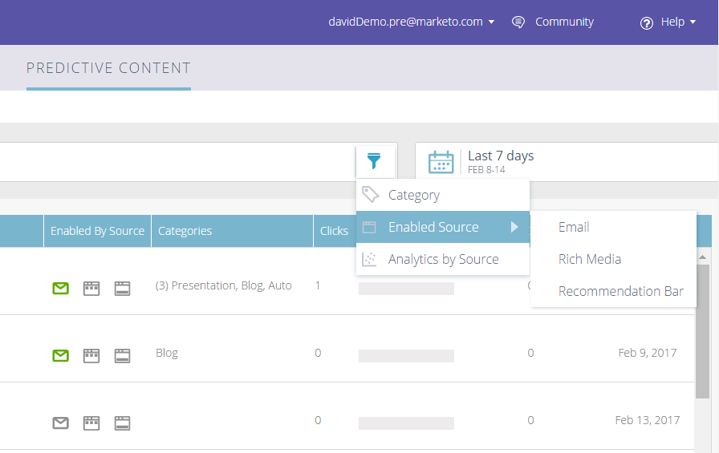

# Opmerkingen bij de release: Winter &#39;17 {#release-notes-winter}

De volgende functies zijn opgenomen in de release van Winter &#39;17. Raadpleeg de Marketo-editie voor informatie over de beschikbaarheid van functies.

Klik op de titelkoppelingen om gedetailleerde artikelen voor elke functie weer te geven.

>[!NOTE]
>
>Als een onderwerp veelvoudige onderverdelingen heeft, worden de verbindingen daar geplaatst.

## [&#x200B; Geavanceerde Vergelijking voor de Auditeurs van Facebook &#x200B;](/help/marketo/product-docs/demand-generation/ad-network-integrations/add-facebook-custom-audiences-as-a-launchpoint-service.md) {#advanced-matching-for-facebook-custom-audiences}

Bij Standaard afstemmen worden alleen e-mailadressen gebruikt, maar bij nieuwe geavanceerde afstemming worden nog zeven velden gebruikt, waardoor de afstemmingsfrequentie voor meer conversie toeneemt.

## [&#x200B; de Invoer API van de Objecten van de Douane &#x200B;](https://developers.marketo.com/rest-api/lead-database/custom-objects/) {#custom-object-import-api}

Deze API biedt een snellere interface voor het synchroniseren van aangepaste objecten in Marketo. U kunt CSV-, TSV- of SSV-spreadsheetbestanden als aangepaste objecten importeren in Marketo.

## [&#x200B; de Campagne van Personalization van het Web de Uitvoer &#x200B;](/help/marketo/product-docs/web-personalization/working-with-web-campaigns/export-web-campaign-data.md) {#web-personalization-campaigns-export}

Exporteer alle details en analyses van uw webcampagne in CSV-indeling. Vervolgens kunt u uw gegevens in een handige indeling bekijken.

## Lokalisatie {#localization}

De apps Web Personalization, [!UICONTROL Predictive Content] en Email Insights zijn nu beschikbaar in het Japans, Duits en Spaans. U [&#x200B; selecteert uw taal en scène &#x200B;](/help/marketo/product-docs/administration/settings/select-your-language-locale-and-time-zone.md) om uw inhoud in deze talen te bekijken.

## Verbeteringen op basis van account {#account-based-marketing-enhancements}

**[de Invoer Genoemde Rekeningen](/help/marketo/product-docs/target-account-management/target/named-accounts/import-named-accounts.md)**

Met de optie [!UICONTROL Named Account] Importeren kunt u meerdere records tegelijk maken of bijwerken via CSV-upload.

**[Steun van de Inzichten E-mail](/help/marketo/product-docs/reporting/email-insights/filtering-in-email-insights.md)**

Gebruik [!UICONTROL Named Account] of [!UICONTROL Account List] als afmetingen in e-mailinzichten.

## [!UICONTROL Predictive Content] Verbeteringen {#predictive-content-enhancements}

**[Filteren op[!UICONTROL Enabled Source]](/help/marketo/product-docs/predictive-content/working-with-predictive-content/understanding-predictive-content.md)**

Filter [!UICONTROL Predictive Content] stukken die zijn ingeschakeld voor [!UICONTROL Email] , [!UICONTROL Rich Media] of [!UICONTROL Recommendation Bar] .

**[Filter[!UICONTROL Analytics by Source]](/help/marketo/product-docs/predictive-content/working-with-predictive-content/understanding-predictive-content.md)**

Filter [!UICONTROL Predictive Content] -analysemogelijkheden voor specifieke bronnen: [!UICONTROL Email], [!UICONTROL Rich Media] of [!UICONTROL Recommendation Bar] .

**[!UICONTROL Predictive Content]Editor**

Er is een verbeterde bewerkingservaring en lay-out waarmee de voorbereiding van inhoud wordt gesplitst naar bron — [!UICONTROL Email], [!UICONTROL Rich Media] of [!UICONTROL Recommendation Bar] .

**[auto-Ontdekking Inhoud voor Predictive](/help/marketo/product-docs/predictive-content/getting-started/enable-content-discovery.md)**

URL en metagegevens van afbeeldingen worden nu gebruikt in het proces voor automatische detectie van inhoud.

## [&#x200B; Verbeteringen van SDK &#x200B;](https://developers.marketo.com/mobile/) {#sdk-enhancements}

Ontwikkelaars hebben nu extra controle over de levering van pushberichten met toevoeging van een nieuwe SDK API-aanroep waarmee ontwikkelaars pushtokens kunnen verwijderen.

## De Integratie van SMS LaunchPoint van Vibes

Verbeter het richten met een nieuwe filteroptie, &quot;Lid van Lijst van Levendigs.&quot;

## [&#x200B; Verouderde Rich de Redacteur van de Tekst en Redacteur 1.0 van de Vorm Verdringing &#x200B;](https://nation.marketo.com/docs/DOC-4315) {#legacy-rich-text-editor-and-form-editor-deprecation}

Vanaf 1 augustus 2017 zullen klanten die nog steeds de oude Rich Text Editor en de Form Editor 1.0 gebruiken, automatisch overstappen op de nieuwe ervaring.

## [&#x200B; de Activiteit APIs van Marketo &#x200B;](https://developers.marketo.com/blog/important-change-activity-records-marketo-apis/) {#marketo-activity-apis}

Een belangrijke wijziging is de activiteit-API&#39;s van Marketo. Bent u voorbereid?
