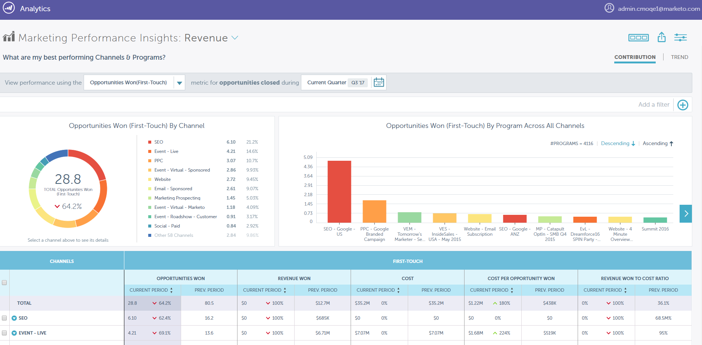

# Opmerkingen bij de release: Winter &#39;18 {#release-notes-winter}

De volgende functies zijn opgenomen in de release van Winter &#39;18. Raadpleeg de Marketo-editie voor informatie over de beschikbaarheid van functies.

Klik op de titelkoppelingen om gedetailleerde artikelen voor elke functie weer te geven. **Nota**: Sommige eigenschappen inbegrepen in deze versie hebben geen bijbehorende artikelen. Als een onderwerp veelvoudige onderverdelingen heeft, worden de verbindingen daar geplaatst.

## Campagneprestaties en uitvoerverbeteringen {#campaign-performance-and-throughput-enhancements}

Marketo maakt gebruik van onze grote gegevensarchitectuur om de productie van campagnes te verhogen en de verwerking van webactiviteiten te verbeteren, zodat u sneller kunt reageren op de acties van uw publiek.

## Verbeteringen voor [!DNL Salesforce] CRM-integratie van Marketo {#enhancements-to-marketo-s-salesforce-crm-integration}

Er zijn twee verbeteringen aangebracht in onze [!DNL Salesforce] CRM-integratie:

* [ Admin van Marketo berichten ](/help/marketo/product-docs/core-marketo-concepts/miscellaneous/understanding-notifications/notification-types.md) voor bepaalde de synchronisatiestouden van CRM (verlopen geloofsbrieven, bereikte API grenzen, enz.)

* [ Mogelijkheid om e-mailberichten ](/help/marketo/product-docs/crm-sync/salesforce-sync/setup/optional-steps/turn-off-email-notifications-to-lead-owner.md) aan Lead Eigenaars op loodtaak uit te zetten

Deze verbeteringen zullen in 2018 worden doorgevoerd.

## [ de Inzichten van de Prestaties van Marketo ](/help/marketo/product-docs/reporting/performance-insights/performance-insights-overview.md) {#marketo-performance-insights}

>[!AVAILABILITY]
>
>[!UICONTROL Performance Insights] is een invoegtoepassing. Neem contact op met uw Marketo Customer Success Manager of Account Executive voor een prijsopgave.

Onderzoek hoe uw campagnes en kanalen bedrijfsresultaten met attributieanalyses, interactieve visualisaties, en een gedetailleerde gegevenslijst beïnvloeden.

## Verbeteringen op basis van account {#account-based-marketing-enhancements}

**[ABM Hiërarchieën](/help/marketo/product-docs/target-account-management/target/named-accounts/tam-hierarchies.md)**

Voor ABM-klanten met [!DNL Salesforce] of [!DNL Microsoft Dynamics] erft ABM nu automatisch de relaties tussen bovenliggende en onderliggende items die in de CRM zijn gemaakt (en geeft deze weer). U zult deze verhoudingen in zowel roll-up rapportering als campagneuitvoering kunnen gebruiken.

## E-mailmarketing {#email-marketing}

**[Dynamisch E-mailmanuscript](/help/marketo/product-docs/email-marketing/general/using-tokens/create-an-email-script-token.md)**

Het scripting van de snelheid wordt nu gesteund in e-mail gebruikend dynamische inhoud. Combineer snelheid en op segmentatie gebaseerde dynamische inhoud om zeer gepersonaliseerde e-mails tot stand te brengen.

**Ontvankelijke Tijdzone van de Tijd**

* **[Maandelijkse Koorden van de Nurtuur](/help/marketo/product-docs/email-marketing/email-programs/email-program-actions/scheduling-with-recipient-time-zone/schedule-email-programs-with-recipient-time-zone.md)**: Wij hebben de capaciteit toegevoegd om programma&#39;s van de Zorg op een maandelijkse kadentie te plannen.

* **[Levering van het Einde](/help/marketo/product-docs/email-marketing/email-programs/email-program-actions/scheduling-with-recipient-time-zone/abort-delivery-of-email-programs-scheduled-with-recipient-time-zone.md)**: U kunt om het even welk blijven nu tegenhouden verzendt midrun.

## Integratie van advertentienetwerken {#ad-network-integrations}

**[de Klant van Google de Integratie van de Gelijke](/help/marketo/product-docs/demand-generation/ad-network-integrations/add-google-customer-match-as-a-launchpoint-service.md)**

Met deze integratie kunt u een Marketo-publiek naar Google sturen dat u als doel wilt instellen met [!DNL Google AdWords] , en doelgroepen heroriënteren over [!DNL YouTube] , Zoeken en [!DNL Gmail] .

**[[!DNL LinkedIn] de Vergroting van PoortenAPI van het Publiek](/help/marketo/product-docs/demand-generation/ad-network-integrations/add-linkedin-matched-audiences-as-a-launchpoint-service.md)**

Met de nieuwe [!DNL LinkedIn] API kunt u nu personen in uw Marketo-database opnieuw toewijzen via meerdere [!DNL LinkedIn] Campagnebeheeraccounts.

## Web Personalization {#web-personalization}

**Japanse Gegevens Source voor Web Personalization**

Marketo voegt een extra Japanse gegevensbron voor Web Personalization toe om de identificatie van de Webbezoeker (omgekeerde IP raadpleging) en verpersoonlijking voor bezoekers te verbeteren die uit Japan komen. Organisatie-namen worden in het Japans weergegeven.

**[creeer een Segment van het Web Gebruikend Statische Lijsten](/help/marketo/product-docs/web-personalization/using-web-segments/create-a-segment-using-a-static-list.md)**

Web Personalization kan inhoud nu personaliseren naar een bekende webbezoeker die deel uitmaakt van een statische lijst die is gedefinieerd in Marketingactiviteiten (MLM). Met deze verbetering, kunt u aan statische lijsten over kanalen nu in de handel brengen en mensen op deze lijsten met gepersonaliseerde inhoud op uw website richten.

## ContentAI {#contentai}

**Predictive de Verbetering van het Algoritme**

Inhoud die wordt aanbevolen via Marketo-algoritmen voor geoptimaliseerde ContentAI genereert maximaal tweemaal zoveel klikken als willekeurige inhoud.

## Integratie {#integration}

**[activeer/deactiveer Campagne API ](https://developers.marketo.com/rest-api/assets/smart-campaigns/)**

Met deze nieuwe API kunt u triggercampagnes op afstand activeren en deactiveren, zodat u nu volledig geautomatiseerde programmasjablonen kunt maken. Maak één keer een programmasjabloon, automatiseer het klonen, verhandel zakelijke updates en activering/planning van slimme campagnes.

## [!DNL ToutApp] {#toutapp}

**Unsubscribe Update**

Vanaf 1 Maart, 2018, zullen alle e-mails die van [ ToutApp.com ](https://ToutApp.com) worden verzonden (en door &quot;E-mail met [!DNL Tout]&quot;knoop in [!DNL Salesforce] te gebruiken) een unsubscribe verbinding hebben die aan de bodem wordt toegevoegd.

**Levende Update van het Gegeven**

We hebben de vormgeving van de tabbladen Betrokkenheid en Taak bijgewerkt, zodat verkopers gemakkelijker en sneller kunnen reageren op de activiteiten van hun klanten rechtstreeks via Live Feed.

**Update van de Mening van het Detail van Mensen**

De verbeterde weergave Personendetails (PDV) biedt een uitgebreide weergave van uw contactpersonen door uw [!DNL Tout] - en [!DNL Salesforce] CRM-contactgegevens samen te brengen.
